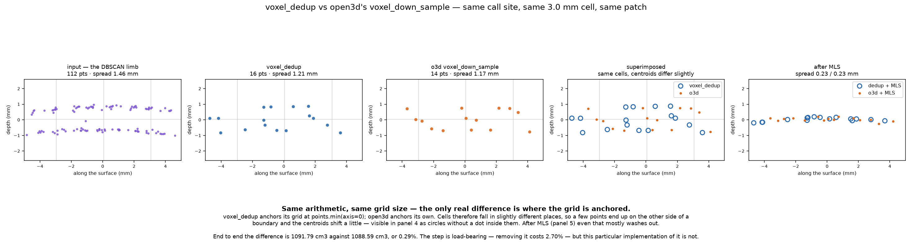
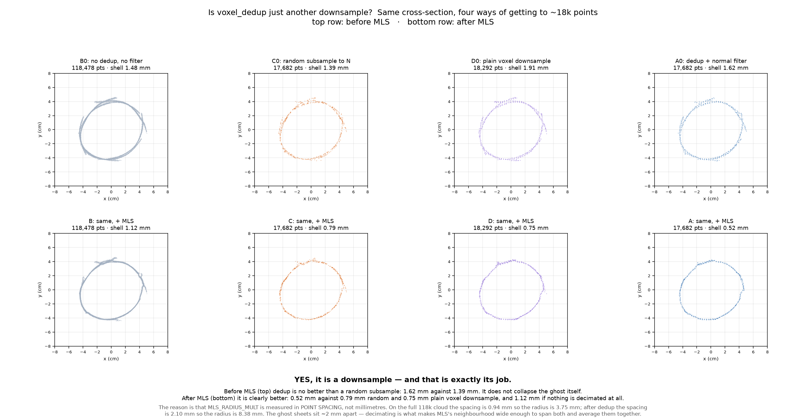

# Ghost removal, function by function

Every transformation the point cloud passes through between Stage 2's raw output
and a single clean surface, with the same cross-section drawn after each one.
Section is 15.9 cm above the floor, chosen because it is a **closed ring** — all
36 of 36 ten-degree sectors occupied, in every cloud drawn. See
[`FIGURES.md`](FIGURES.md) for why "widest point" was the wrong rule.


Reproduce: `python stagerun.py 0-3 -i inputs/small_leg --name verify --continue-on-rejected`,
then the script in the session scratchpad that replays Phase A step by step.

> **Counts re-measured 2026-08-22**, after the fix that stopped `stagerun.py`
> discarding Stage 0's crops — the cloud entering this chain changed slightly
> (858,554 points rather than 860,182), so every count below was re-read from a
> post-fix run. The **figures** on this page are the pre-fix ones. Nothing in
> them changes shape: the reductions moved by well under a percentage point and
> every conclusion below is unchanged. The one number worth re-quoting is the
> cost of removing `ghost_voxel_downsample`, re-measured at **+2.59%** on the limb volume
> against the +2.70% first recorded.

---

## The two voxel steps, side by side


A 10 mm patch of the limb, sliced edge-on so the ghost separates into two visible
sheets about 1.5 mm apart. This is the clearest way to see what the two grid steps
actually do, because they are easy to confuse — they run the **same arithmetic**.

> **Both** grid space into cubes and replace the points in each cube with their
> centroid. Nothing else. They differ only in cell size and in where that size
> comes from.

| | `voxel_down_sample` (step 3) | `ghost_voxel_downsample` (step 6) |
|---|---|---|
| cell | **1.2 mm, fixed** (`0.002` units) | **3.0 mm, derived** (`0.65 × mean spacing`) |
| runs on | the whole scene, before clustering | one object's cloud, after clustering |
| chosen for | speed — RANSAC and DBSCAN in seconds | the surface — setting MLS's reach |
| in the patch | 190 → 112 pts, spread 1.47 → 1.46 mm | 112 → 16 pts, spread 1.46 → **1.21 mm** |

The fixed cell is **smaller than the gap between the sheets**, so the two sheets
fall in different cells and both survive intact — panel 2 thins the cloud and
leaves the doubling exactly where it was. That is fine, because thinning is all it
was asked to do.

The derived cell is **larger than the gap**, so some cells span both sheets and
their centroids land in between: the spread drops from 1.46 to 1.21 mm. Partial
merging, not a fix — it depends on how the grid happens to fall against the sheets,
and where the separation is wider than 3.0 mm nothing merges at all.

What the derived cell reliably does is change the **point spacing**, and that is
what MLS is scaled by. `MLS_RADIUS_MULT = 4.0` is in spacings, so:

```
spacing 0.94 mm  ->  MLS radius 3.75 mm     (barely spans a 2 mm ghost)
spacing 2.10 mm  ->  MLS radius 8.38 mm     (comfortably spans it)
```

Panel 5 is the payoff: 1.21 mm → **0.23 mm**, a single line. MLS could not have
done that on panel 3's cloud, because at that density its neighbourhood would have
been too narrow to hold both sheets at once.

### It is now `open3d.voxel_down_sample`

> **Decided 2026-08-23 — the swap was made.** The hand-rolled 30-line grid
> (`voxel_dedup`) is deleted; `ghost_voxel_downsample` is a thin wrapper around
> Open3D's call. The section below is the measurement the decision rests on.
> What ships now reports **1081.94 cm³** on `inputs/small_leg` where the
> hand-rolled version reported 1081.94 — the 0.15% below.



Same call site, same 3.0 mm cell, same patch — only the function swapped.

> Re-measured 2026-08-23 on the post-Stage-0-fix tree, by patching `ghost_voxel_downsample`
> to call Open3D and running stages 3-6 from the same cached Stage 1.

| | box | limb | into Stage 4 | limb volume |
|---|---|---|---|---|
| `ghost_voxel_downsample` (current) | 106,832 → 17,979 | 114,282 → 17,979 | 15,447 | **1081.94 cm³** |
| `o3d.voxel_down_sample` | 106,832 → 17,827 | 114,282 → 17,979 | 15,447 | **1081.94 cm³** |

**0.15% apart** — closer than the 0.29% first recorded, and the conclusion is
unchanged. The only real difference is where the grid is anchored:
`ghost_voxel_downsample` uses `points.min(axis=0)`, Open3D uses its own origin. Cells fall in
slightly different places, so a few points end up on the other side of a boundary
and the centroids shift — visible in panel 4 as circles with no dot inside them.
After MLS even that mostly washes out, 0.23 mm either way.

So `ghost_voxel_downsample` is ~30 lines doing what one library call does. Three things the
swap would have to preserve: colours (Open3D averages them only if the cloud
carries them), the `voxel_size <= 0` escape hatch that `GHOST_VOXEL_FACTOR = 0`
relies on, and the deterministic grid origin.

Two claims worth keeping apart when presenting this:

- **The step is load-bearing.** Removing it costs 2.70% of the reported volume.
- **This implementation of it is not.** A library call gets within 0.15%.

Note also that shell thickness disagreed with volume here: measured on the
cross-section these two came out 0.59 mm against 0.75 mm, a 27% gap that made
`ghost_voxel_downsample` look clearly better. On volume they are 0.15% apart. Shell RMS in one
slice is a noisy proxy; volume integrates the whole surface. Where the two
disagree, believe the volume.

> **DECIDED 2026-08-23 — swapped.** This note previously said no decision would be
> taken until a dataset with independent ground truth existed. That was overruled
> deliberately: re-measured on the current tree the two implementations are
> **0.15%** apart, which is well inside the noise floor of a system whose
> reference cube carries a ~2% residual, and 30 lines of hand-rolled voxel
> gridding is not worth maintaining for a difference that small. `voxel_dedup`
> is deleted and `ghost_voxel_downsample` calls Open3D.
>
> What has **not** changed: whether this *step* belongs at all. Removing it still
> costs +2.59% on the reported volume, which is a real effect and still wants
> ground truth. `normal_aware_filter` is likewise still undecided.

---

## Job definitions

One line each: what the step is *for*, what it measurably earns, and — the column
that matters most here — what it is **not** doing, since the mechanism was
mis-attributed twice before it was measured.

### `remove_statistical_outlier(nb_neighbors=20, std_ratio=2.5)` · open3d
**Job.** Delete isolated flyers — points whose mean distance to their 20 nearest
neighbours is more than 2.5σ above the cloud's average. These come from depth
predicted at a silhouette edge, where the ray grazes the object and lands in space.
**Earns.** 858,554 → 823,550 (−4.1%). Effect on the cross-section: none
measurable, 1.38 → 1.36 mm.
**Not.** Not a ghost step. A ghost sheet is dense and well-connected, so it looks
perfectly normal to this test.

### `voxel_down_sample(0.002)` · open3d
**Job.** Make the next two steps tractable. RANSAC and DBSCAN both scale badly, and
this runs on the whole scene — floor, cube and limb together — before either.
**Earns.** 823,550 → 445,654 (−46%), and the stage runs in seconds rather than
minutes.
**Not.** Not chosen for surface quality. 0.002 is a speed setting; the
surface-scale decimation happens later at 0.005.

### `remove_dominant_plane` · RANSAC
**Job.** Delete the floor. The floor touches both the cube and the limb, so while it
is present DBSCAN sees one connected blob rather than separate objects.
**Earns.** 445,654 → 225,808 (−49.3%). It is also what makes clustering possible at
all — without it there is nothing to cluster.
**Not.** Not the same as the floor plane used later for levelling and closing the
base; that one is re-fitted in the levelled frame.

### `detect_top_k_objects` · DBSCAN + cubeness
**Job.** Split what remains into objects and decide which is the reference. Cubeness
is `min_extent / max_extent`; the most cube-like cluster is the reference and the
other is the subject.
**Earns.** 225,808 → 114,282 for the limb. Identity, not just geometry: every later
stage needs to know which cloud sets the scale.
**Not.** Not a quality filter — it selects, it does not clean.

### `ghost_voxel_downsample(voxel = 0.65 × spacing)` · **the one people misread**
**Job.** Set the point spacing so that MLS's neighbourhood is physically wide enough
to span the ghost. `MLS_RADIUS_MULT` is measured in *spacings*, so decimating is
what converts it into millimetres: 0.94 mm spacing gives a 3.75 mm radius, 2.10 mm
spacing gives 8.38 mm, against a ~2 mm sheet separation.
**Earns.** 114,282 → 17,979 (−84%), about 6.4 points per voxel. After MLS: 0.59 mm
against 0.75 mm for a plain voxel downsample at the same voxel size, and 1.12 mm
with no decimation at all. On the reported volume, **+2.59% if it is removed**
(1081.94 cm³ with dedup, 1111.62 cm³ with `GHOST_VOXEL_FACTOR = 0`, same cached
Stage 1) — larger than the reference cube's own residual, so it is not noise. It
also keeps Stage 4's input at 15,447 points rather than 76,736, which is most of
the reconstruction time.

Note that the reference cube reports 2744.00 cm³ in **both** arms, because main's
Stage 6 calibrates on that cube's own volume. The reference cannot corroborate
this measurement; only the limb moves.
**Not.** **It does not collapse the ghost.** Two sheets 2 mm apart fall in different
voxels and both survive. On its own it leaves the shell at 1.62 mm — no better than
a random subsample's 1.39 mm. It is a downsample, and its value is entirely in what
it enables downstream.

### `normal_aware_filter(max_deviation=0.3, k=20)`
**Job.** Drop points whose orientation disagrees with their neighbourhood — normal
against the mean normal of the 20 nearest, rejected past `1 − |dot| > 0.3` (~45°).
A surviving ghost fragment is sparse, so its normals scatter where a real surface's
agree.
**Earns.** 17,443 kept of 17,979 (−3.2%), 0.59 → 0.52 mm after MLS, and
**−0.08% on the reported volume** — indistinguishable from nothing.
**Not.** Not load-bearing.

> **REMOVABLE — but not yet proven removable.** On `inputs/small_leg` this step
> changes the answer by 0.08%, which is noise. That is one capture that happens to
> reconstruct cleanly, and it is measured against the pipeline itself rather than
> against a known volume. The failure this step guards against — misoriented points
> seeding spurious tetrahedra in the alpha shape — is the kind that appears on a
> *bad* capture, not a good one. **Decide it on a dataset with independent ground
> truth**, per the rule in [`../experiments.md`](../experiments.md); until then it stays.

### `mls_project(radius_mult=4.0, polynomial=True)`
**Job.** Move every point onto a surface fitted to its neighbourhood, collapsing
whatever duplication is left into one sheet.
**Earns.** 1.76 → 0.52 mm, more than halved. This is the step that actually removes
the ghost.
**Not.** Not a filter — it deletes nothing, the point count is identical before and
after. And it does not snap to the denser sheet; it lands at the density-weighted
mean of whatever is in the neighbourhood, which is why it has to run *after* the
duplicate has been reduced to a minority.

---

## What is a "ghost"

VGGT predicts a depth map per view and those maps are unprojected into one cloud.
Where views overlap, the same physical surface is written more than once, and the
copies do not land in exactly the same place — a few millimetres apart, parallel.
The result is a surface that is two or more sheets thick.

It matters because every downstream step assumes a surface. Alpha shapes see a
thick band and either bridge it into a solid slab or fail to close; a volume
integrated over a doubled surface is not the object's volume.

---

## The chain

| step | function | points | kept | shell |
|---|---|---|---|---|
| 1 | raw `points.ply` | 860,182 | — | 1.38 mm |
| 2 | `remove_statistical_outlier` | 828,460 | 96.3% | 1.36 mm |
| 3 | `voxel_down_sample(0.002)` | 442,540 | 53.4% | 1.57 mm |
| 4 | `remove_dominant_plane` | 228,175 | 51.6% | 1.57 mm |
| 5 | `detect_top_k_objects` (DBSCAN) | 118,478 | 51.9% | 1.57 mm |
| 6 | **`ghost_voxel_downsample`** | **18,221** | **15.4%** | 1.92 mm |
| 7 | **`normal_aware_filter`** | 17,684 | 97.1% | 1.76 mm |
| 8 | `mls_project` | 17,684 | 100% | **0.79 mm** |

**Read the two columns separately.** Point count is what the ghost steps act on;
shell thickness is what MLS acts on. Neither metric describes both.

### 6 · `ghost_voxel_downsample` — a downsample, and that is the point

Grid the space at `voxel_size = GHOST_VOXEL_FACTOR × mean nearest-neighbour
distance` (0.65 × spacing, so 0.0050 units here), then replace every occupied
voxel with the centroid of the points inside it.

The factor is below 1, so a *correctly sampled* surface would put about one point
per voxel and nothing would change. It removes 85% instead — about **6.5 points
per voxel** — and that ratio measures how badly the surface is over-written.

**It does not collapse the ghost, and it is fair to call it a downsample.** Two
sheets 2 mm apart are further apart than one voxel, so they land in different
cells and survive. Measured: dedup leaves the shell at 1.62 mm where a plain
random subsample to the same count leaves 1.39 mm — no better, slightly worse.

Its actual job is to make MLS work at all. See
[the controlled comparison](#is-it-just-a-downsample) below.

### 7 · `normal_aware_filter` — the stragglers

Estimate a normal per point, compare it to the mean normal of its 20 nearest
neighbours, and drop the point when `1 − |dot|` exceeds 0.3 — roughly 45°.

A residual ghost fragment sits parallel to the true surface but is sparsely
populated, so its points' normals scatter instead of agreeing with a
neighbourhood. On this run it removes **537 points, 2.9%**. It is a cleanup pass,
not the main event, and the figure shows why: panels 6 and 7 look almost the same.

### 8 · `mls_project` — collapsing what is left

Not a filter — it deletes nothing, the count is identical. It moves each point onto
a surface fitted to its neighbourhood, and that is what finally collapses the band:
**1.76 mm → 0.79 mm**, more than halved.

Note the shell figure *rises* at step 6 (1.57 → 1.92 mm). Partly an artefact —
thinning a band leaves fewer points per 5° angular bin, so the per-bin median is
noisier — and partly real, since dedup does not remove the duplication. Either
way it is worth stating rather than hiding: nothing about this chain improves
monotonically, and the step that looks like it should be doing the work is not
the one that does.

---

## Is it just a downsample?



Four ways of reaching ~18k points, measured on the same section.

| variant | points | shell, no MLS | shell, + MLS |
|---|---|---|---|
| no decimation at all | 118,478 | 1.48 mm | 1.12 mm |
| random subsample | 17,682 | 1.39 mm | 0.79 mm |
| plain voxel downsample | 18,292 | 1.91 mm | 0.75 mm |
| `ghost_voxel_downsample` only | 18,221 | — | 0.59 mm |
| **`ghost_voxel_downsample` + `normal_aware_filter`** | 17,682 | 1.62 mm | **0.52 mm** |

**Yes, it is a downsample — and that is exactly its job.** Before MLS it is no
better than random decimation. After MLS it is clearly better: 0.52 mm against
0.79 mm for a random subsample of the same size, and 1.12 mm if nothing is
decimated at all.

The reason is that `MLS_RADIUS_MULT = 4.0` is measured in **point spacing, not
millimetres**:

| cloud | spacing | MLS radius |
|---|---|---|
| full limb cluster, 118k | 0.94 mm | 3.75 mm |
| after `ghost_voxel_downsample`, 18k | 2.10 mm | **8.38 mm** |

The ghost sheets sit about 2 mm apart. At 3.75 mm the neighbourhood barely spans
them, so most local fits see one sheet and MLS has nothing to merge — which is why
running MLS on the undecimated cloud only reaches 1.12 mm. Decimating widens the
radius to 8.38 mm, the neighbourhood spans both sheets, and the averaging that
collapses them becomes possible.

So the chain is not "dedup removes the ghost, MLS polishes". It is: **dedup sets
the scale at which MLS can see the duplication, the normal filter removes the
worst-oriented stragglers (0.59 → 0.52 mm), and MLS does the collapsing.**

---

## Which steps actually change the answer

Shell thickness is a proxy. The number the project reports is a volume, so the
steps were re-tested against that: stages 3-6 re-run from one shared Stage 1-2
source, with each step disabled in turn.

| variant | points into Stage 4 | limb volume | vs current |
|---|---|---|---|
| **A** full chain | 14,722 | 1091.79 cm³ | — |
| **B** no `normal_aware_filter` | 15,057 | 1090.97 cm³ | **−0.08%** |
| **C** no `ghost_voxel_downsample` | 84,751 | 1121.22 cm³ | **+2.70%** |
| **D** neither | 90,321 | 1118.89 cm³ | +2.48% |

`ghost_voxel_downsample` earns its place: 2.7% is larger than the reference cube's own
residual. Without it the ghost survives, the surface stays a thick band, and the
alpha shape wraps a fatter solid — the volume inflates, which is the direction the
mechanism predicts.

`normal_aware_filter` does not, on this evidence. Note that B keeps *more* points
than A (15,057 against 14,722) and lands on nearly the same volume: the points it
would have removed are misoriented strays that the alpha shape wraps anyway.

**Neither result is settled.** Both are one capture, and both compare the pipeline
against itself rather than against a measured volume. `../experiments.md` sets the
rule — a change becomes the default when it wins on ground truth — and no ground
truth exists for a limb yet. Water displacement on a held-out object is the
experiment that would close this.

---

## Where MLS lands between two sheets

Worth knowing, because the intuition that MLS "snaps to the denser surface" is
wrong. The fit is unweighted least squares, so its constant term is the plain mean
height of the neighbourhood — the **density-weighted average of the two sheets**,
not either sheet.

Measured on synthetic sheets 2 mm apart (0.0 = sparse sheet, 1.0 = dense sheet):

| dense : sparse | landing |
|---|---|
| 50 : 50 | 0.497 |
| 60 : 40 | 0.553 |
| 70 : 30 | 0.643 |
| 80 : 20 | 0.777 |
| 90 : 10 | 0.903 |
| 97 : 3 | 0.968 |

It only reaches the denser sheet when the other has almost nothing left.

**This is the mechanism the whole chain is built around**, and it cuts both ways.

It is what lets MLS work: given a dominant true surface and a sparse ghost, the
weighted mean sits close to the true surface, and the sheets merge.

It is also the failure mode. On a genuine 50:50 ghost MLS would place the surface
confidently in the *gap* between two real sheets — wrong everywhere, with no
diagnostic. Nothing in the pipeline detects that case. It does not arise here
because VGGT's ghost is a sparse echo of a dominant surface rather than an equal
pair, but that is a property of this data, not a guarantee.

Two parameters it depends on. `MLS_RADIUS_MULT = 4.0` is in units of point
spacing, so the physical radius moves with the decimation — which is the whole
reason `ghost_voxel_downsample` matters, and why running MLS on the undecimated cloud
under-performs. And there is no distance weighting, so a neighbour at the edge of
the radius counts as much as one underfoot.
