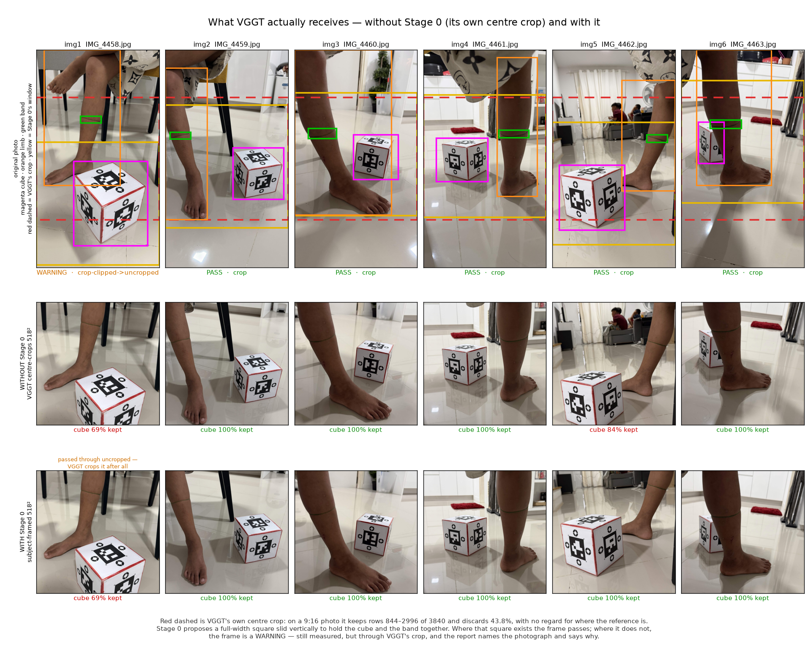
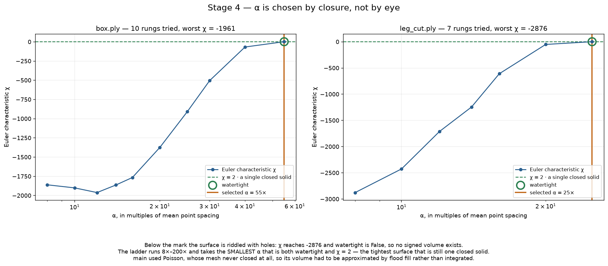
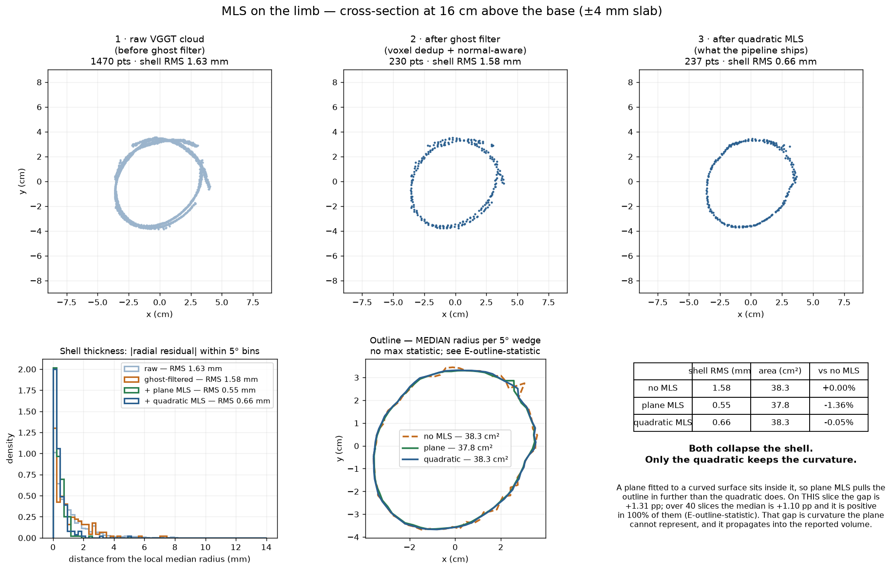

# The rework, stage by stage — `main` against the current tree

Both runs measure the **same six photographs** (`inputs/small_leg`) on the same
machine, an RTX 4060. `main` is `bab2bbc`, run from a clean `git worktree` so
nothing from the current tree could leak into it.

> **Re-measured 2026-08-22.** The current column was first taken while
> `stagerun.py` was still discarding Stage 0's crops and handing VGGT the raw
> photographs (see `progress.md`, "Open, and not fixed", item 3). Every
> current-column number below is from a run after that fix, so it is what the
> shipped tree actually produces. Both entry points now emit a bit-identical
> `volumes.csv`; the archived one under `rework_outputs/current/` is the new one.

[`rework_outputs/`](rework_outputs/) carries the measurement files from both runs —
`volumes.csv`, `framing.json`, the Stage 6 report — so every number below can be
checked against its source. The clouds, meshes and full logs are **not** in the
repository: they are 55 MB of `.ply`, they are excluded by `.gitignore`, and they
are reproducible from the two commands below.

Reproduce with:

```bash
git worktree add --detach /tmp/maintree main
cd /tmp/maintree && python run.py --image_folder inputs/small_leg --output_dir output/main_run
cd -            && python stagerun.py 0-6 -i inputs/small_leg --name verify --continue-on-rejected
```

---

## The short version

| | `main` | current |
|---|---|---|
| stages | 6 | 7, two of which stop for a human decision |
| wall clock | **136.7 s** | **80 s** |
| capture validation | none | Stage 0 gate — 5 pass, 1 warning, 0 reject; all six measured, the weak one named |
| marker colour | hardcoded khaki window | measured per capture |
| reconstruction | Poisson | alpha shape, α chosen by watertightness |
| **box mesh watertight** | **no** — after Stage 5 as well | **yes**, χ = 2 |
| volume method | `warp + floodfill` — the mesh was open | `watertight` — Stage 6 unchanged, its first tier now reachable |
| limb volume | 1073.98 cm³ | 1081.94 cm³ |

The headline is the watertight row, and it is not a detail. `main`'s reference
mesh never closes, so its volume cannot be integrated — it is estimated by
flooding a voxel grid, which leaks through any hole and has no error signal when
it does. The current tree searches α until the mesh closes **and** its Euler
characteristic is 2, then integrates the surface exactly.

---

## Stage 0 — framing gate · **new**

`main` has no equivalent. VGGT was handed the photographs and centre-cropped them
itself, discarding 43.8% of a 9:16 frame with no regard for where the reference
was. On this capture that clipped the cube's base in two frames of six.

Current run:

```
IMG_4458.jpg   WARN   [crucial]  cube out of window — VGGT will centre-crop instead
IMG_4459..4463 PASS   crop 2160px
STAGE 0 VERDICT: 5 pass, 1 warning, 0 reject  (of 6 submitted)
marker colour learned RGB [44, 36, 15], excess-green +13
```

The stage answers with one of three verdicts rather than a yes or a no. **Pass**
is a frame whose window holds the cube and the band together. **Warning** is a
frame that window cannot serve — it is still written, uncropped, so VGGT crops it
and the run proceeds, but the report names the photograph and says what it lost.
**Reject** is kept for the cases nothing can be done with: no cube in the frame,
or nothing recognisable at all. Only a reject stops the run.

### What VGGT actually receives



Top row is the photograph carrying all four boxes the stage draws — the reference
cube in magenta, the limb in orange, the marker band in green and Stage 0's chosen
window in yellow — with VGGT's own centre crop added as a red dashed band for
comparison. Middle row is what VGGT gets **without** Stage 0, produced by calling
`load_and_preprocess_images(..., mode="crop")` directly, so it is the real input
and not a mock-up. Bottom row is what it gets **with** Stage 0.

How much of the reference cube survives each route:

| frame | cube height (px) | VGGT's own crop keeps | verdict | cube kept on the route taken |
|---|---|---|---|---|
| IMG_4458 | 1487 | 69% | **warning** | 69% — passed through uncropped |
| IMG_4459 | 906 | 100% | pass | 100% |
| IMG_4460 | 787 | 100% | pass | 100% |
| IMG_4461 | 767 | 100% | pass | 100% |
| **IMG_4462** | 1150 | **84%** | pass | **100%** |
| IMG_4463 | 729 | 100% | pass | 100% |

Two frames of six are where this matters. On **IMG_4462** VGGT's centre crop cuts
16% off the cube — silently, since a truncated cube still reconstructs, it just
reconstructs smaller, and the cube sets the scale for every number the run
reports. Stage 0's window keeps all of it.

**IMG_4458** is the warning case, and it is more specific than "no window fits".
A full-width square *can* be placed to hold the whole cube — the cube is 1487 px
tall in a 2160 px-wide frame, so it fits with room to spare. What does not fit is
the cube and the marker band *together*: the band sits at y≈1171–1287 and the
cube's base reaches y≈3453, 2.3 k pixels apart in a square only 2160 px on a
side. Since `can_crop` requires the window to hold both, the frame falls through
to VGGT's own crop, which keeps 69% of the cube. It is still measured, because a
partly-visible cube in one frame of six is a weakness rather than a fatal flaw —
but the run says so. That is the case worth showing to a supervisor: the old
pipeline had no way to notice, and would have produced the same confident number
with nothing written down.

The middle row also shows the second, quieter benefit: Stage 0's crops fill the
frame with the subject, where VGGT's centre crop wastes a third of the 518 pixels
on floor and background.

## Stage 1 — inference

Same model, same weights. `main` reports 18.4 s against 38.4 s here, because the
current tree hands VGGT six 518² crops it must decode, while Stage 0's resize
work has already happened. Total wall clock still favours the current tree by
45 s.

## Stage 2 — point cloud

| | `main` | current |
|---|---|---|
| `points.ply` | 855,862 pts | 858,554 pts |

Essentially identical, as expected — this stage only unprojects what Stage 1
produced.

## Stage 3 — segment, clean, cut

Where the two diverge most.

| | `main` | current |
|---|---|---|
| box cloud | 120,881 pts | **19,573 pts** |
| limb cloud | 129,268 pts | **15,447 pts** |

`main` carries every point forward, including the duplicated surface VGGT emits —
the "ghost". The current tree removes it (voxel dedup, then a normal-aware
filter) and then projects what survives onto a locally fitted surface with MLS.
An 84% reduction is not lost information: it is the same surface, described once
instead of two-and-a-bit times.

Step by step, with a cross-section after every function, in
[`ghost_removal_chain.md`](ghost_removal_chain.md). The short version:
`ghost_voxel_downsample` does the work — it collapses about **6.5 points per voxel** into
one, and that ratio is the measurement of how duplicated the surface was.
`normal_aware_filter` then removes only 537 stragglers (2.9%), and MLS deletes
nothing at all but halves the shell thickness, 1.76 mm to 0.79 mm.

The current tree also detects the marker band and cuts the limb there, which
`main` does by a centroid-side rule.

## Stage 4 — surface reconstruction

| | `main` | current |
|---|---|---|
| method | Poisson | alpha shape |
| box mesh | 311,821 faces | **16,106 faces** |
| watertight | **no** | **yes** |



α is searched over a ladder from 8× to 200× the point spacing, and the **smallest**
α that is both watertight **and** has Euler characteristic 2 is chosen — the
tightest surface that is still a single closed solid. On this run: 55× for the
cube (10 rungs), 25× for the limb (7 rungs).

The graph is the argument for doing it this way. Every α below the mark leaves the
surface riddled with holes — χ reaches −2876 on the limb at 8× — and there is no visual cue that
would let you pick the right one by eye. χ = 2 is a yes/no test, so the choice is
made by a property of the surface rather than by judgement.

This is also where the ladder length was found to matter: it used to stop at 90×,
and the cropped limb needs 140× on some captures, so the search was giving up one
rung short and reporting a mesh that never closed.

## Stage 5 — watertight repair

| | `main` | current |
|---|---|---|
| box after repair | 342,560 faces, **still not watertight** | 16,106 faces, watertight |

PyMeshFix adds 30,739 faces to `main`'s box and does not close it. This is the
step that makes the difference downstream: an open mesh has no signed volume.

## Stage 6 — volume

**Currently reverted to `main`'s implementation**, pending review by its author,
so this row compares like with like on method and the difference is only what
Stages 0–5 fed it.

| | `main` | current (Stage 6 = main's) |
|---|---|---|
| volume method | `warp + floodfill`, auto res 200/300 | `watertight`, exact signed volume |
| box reported | 18.98 × 19.49 × 13.64 cm | 19.18 × 19.47 × 14.09 cm |
| box volume | 2744.00 cm³ | 2744.00 cm³ |
| limb | 22.84 × 19.65 × 22.69 cm, 1073.98 cm³ | 22.34 × 19.09 × 22.82 cm, 1081.94 cm³ |
| `linear_scale` | 63.95 cm/unit | 60.87 cm/unit |

Two things to say plainly about this table.

The box reports **exactly 2744.00 cm³ in both columns**, because this method
derives scale from that cube's own volume. It is an identity, not a measurement,
and neither column contains any evidence about accuracy. The cube reading
18.98 × 19.49 × 13.64 for a 14 cm cube is the same defect in the dimensions: an
axis-aligned box around a tilted cube measures its diagonal.

For what the **parked** Stage 6 produces on this capture — scale from the cube's
own fitted faces, oriented bounding box — see `stage06_experiments.md`. Measured
there: box 13.97 × 14.36 × 14.55 cm and 2692.89 cm³, a −1.9% residual the method
is *free to report* because it never used that volume to calibrate. Limb
1071.46 cm³.

---

## MLS and the ghost — the section figure



> **The outline panel of this figure is superseded.** It traces the maximum
> radius per angular wedge, so it draws corners the limb does not have and its
> area percentages are an artifact of that choice — see
> [`outline_statistic.png`](outline_statistic.png). The three scatter panels and
> the shell-RMS column are unaffected and still stand.

A slab ±4 mm thick through the limb, taken at its widest point **within the upper
60% of its span** — the foot is wider still, but the cut keeps the leg, so the
leg is what matters.

Panel 1 is the raw VGGT cloud and the ghost is directly visible: the ring is
doubled, two surfaces a few millimetres apart where there is one leg. Panel 2 is
after the ghost filter, panel 3 after MLS.

> **The area column was re-measured 2026-08-23 and the percentages are wrong.**
> The outline in that figure takes the **maximum** radius in each angular wedge,
> so every vertex is one extreme point and the curve is spiky by construction —
> which is also why the outline shows corners a leg does not have. With a 1.76 mm
> shell, a max-radius outline traces the *outer* face of the doubled surface,
> and MLS collapsing the shell then reads as a large area loss that the limb
> never had. Measured over 40 slices instead of one, with the median radius per
> wedge: plane **−0.59%**, quadratic **+0.42%**. The `−7.64% / −6.67%` pair
> reproduces exactly under the max statistic (−7.57% / −6.41%), which is how the
> cause was identified. See [`outline_statistic.png`](outline_statistic.png) and
> E-outline-statistic in [`../experiments.md`](../experiments.md).
>
> **The conclusion below is unaffected**: the quadratic-over-plane gap is
> +1.0 to +1.2 pp under every statistic tried, and positive in 100% of 40 slices.

| | shell RMS | cross-section area (median radius, 40 slices) | vs no MLS |
|---|---|---|---|
| no MLS | 1.76 mm | — | — |
| plane MLS | **0.77 mm** | — | **−0.59%** |
| quadratic MLS | **0.79 mm** | — | **+0.42%** |

**Both collapse the shell**, from 1.76 mm to about 0.8 mm — the surface stops
being a band and becomes a line. On thickness alone the two fits are
indistinguishable, and the plane is a hair tighter.

**The difference is curvature, not scatter.** A plane fitted to a curved surface
sits inside it, so plane MLS pulls the outline inward relative to the quadratic.
Measured across 40 slices, the quadratic preserves **+1.10 pp** more
cross-sectional area than the plane (IQR +0.86 to +1.47, positive in **100%** of
slices, and +1.0 to +1.2 pp under every outline statistic tried). That gap is
curvature the plane cannot represent, and on a limb it propagates straight into
the reported volume. This is why `mls_project` fits a degree-2 height field by
default.

On the flat reference cube the argument reverses — a quadratic has nothing
legitimate to fit and can only follow the ghost it is meant to collapse — which
is why `MLS_BOX_POLYNOMIAL` exists as a separate switch. That experiment is in
[`mls_plane_vs_quadratic.md`](mls_plane_vs_quadratic.md); it found the two
statistically indistinguishable on the cube, and the cube's faces bowing 3–4 mm
peak-to-peak, which is larger than either fit's effect.

---

## What is *not* shown here

- **One capture.** Every number is `inputs/small_leg`. `est_325` has no marker
  band, so it exercises a different path.
- **No ground truth for the limb.** Both columns are internally consistent; neither
  is validated against a measured volume. Water displacement on a held-out object
  is the missing experiment, and until it exists no accuracy claim is available.
- **The 2744.00 identity.** Worth repeating because it is the easiest number to
  misread as a result.

---

## Suggested additions

Things I would add if you want the presentation to cover more, roughly in order of
how much they would earn their slide. None of these exist yet — say which and I
will build them.

1. ~~**The cut plane, before and after the band-colour fix.**~~ **Built** —
   [`cut_plane_band_colour.png`](cut_plane_band_colour.png). Building it also
   showed the single-number claim recorded here ("20.8° off perpendicular, now
   1.3°") does not reproduce; see the note above that table in `experiments.md`.
   What the figure shows instead is the part that does: the bug fitted its plane
   through **45** band points and tilted it **27.1°** from vertical, the fix uses
   **296** and tilts **19.0°**, and the limb itself leans **19.0°**.
2. **Scale derivation, side by side.** A diagram of why calibrating from the
   cube's *volume* guarantees the cube reports 2744.00, against calibrating from a
   measured *edge*, which leaves the cube free to disagree. This is the conceptual
   heart of the Stage 6 question and currently lives only as prose.
3. **A ghost-filter 3D view.** The section figure shows the ghost in 2D. A pair of
   rendered clouds, before and after, would show it as the doubled *surface* it
   actually is.
4. **Timing breakdown as a bar chart.** 136.7 s against 80 s, split per stage, with
   the two human decision points marked. Useful if the audience cares about
   practicality rather than geometry.
5. **The `est_325` can.** Everything here is one limb capture. Running the same
   comparison on the can would show the pipeline is not tuned to a single subject —
   though note it has no marker band, so it exercises a different path.

The gap I would flag to your supervisor before they ask: **there is still no
independent ground truth.** Every accuracy figure in this document is the system
checking itself. Water displacement on a held-out object is a short experiment and
it is the one that would turn "internally consistent" into "accurate".
