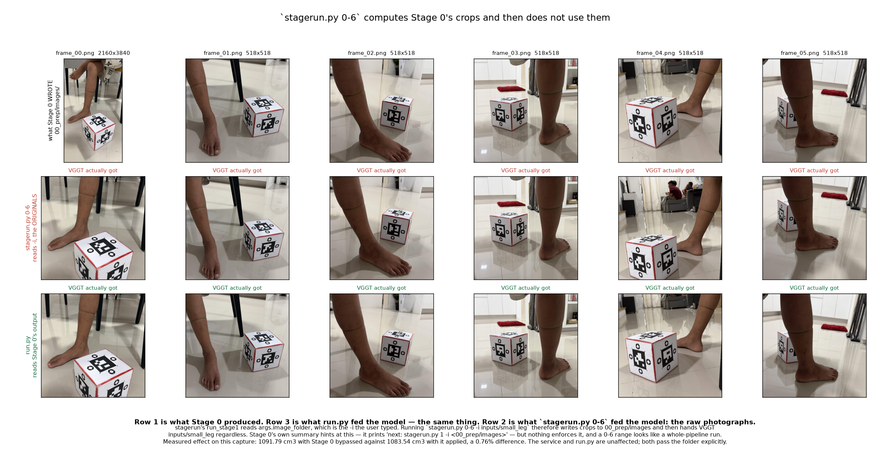
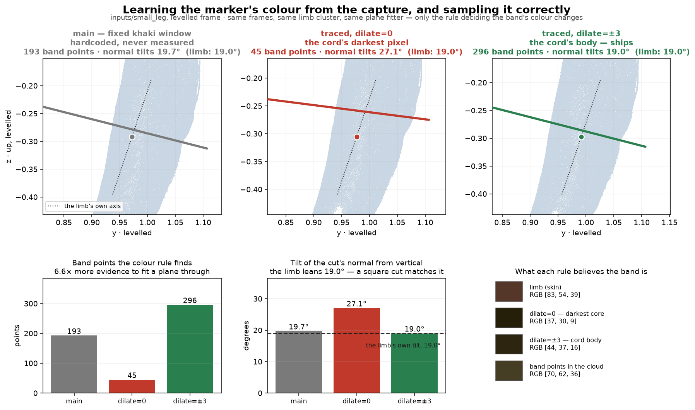
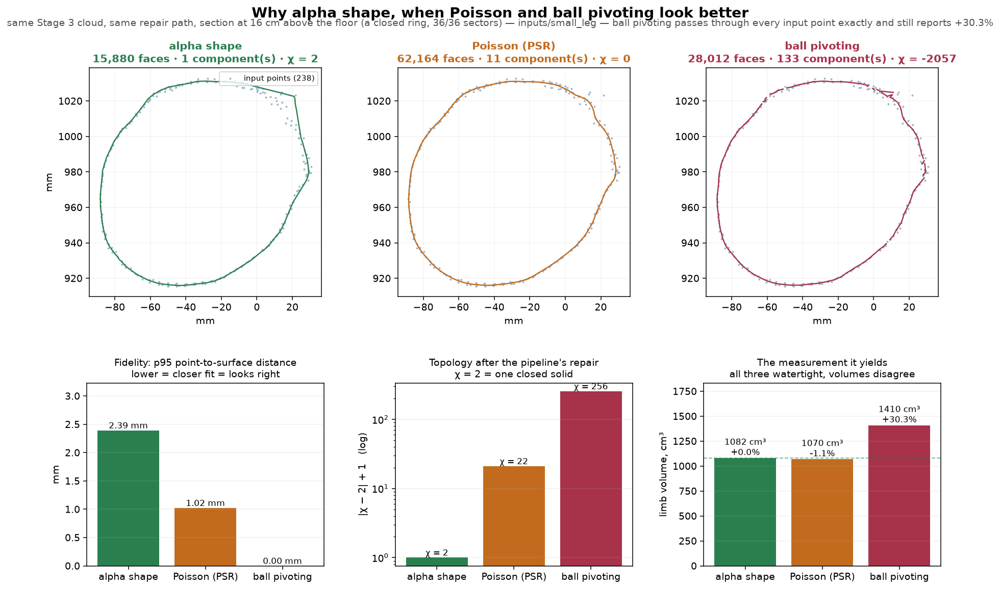
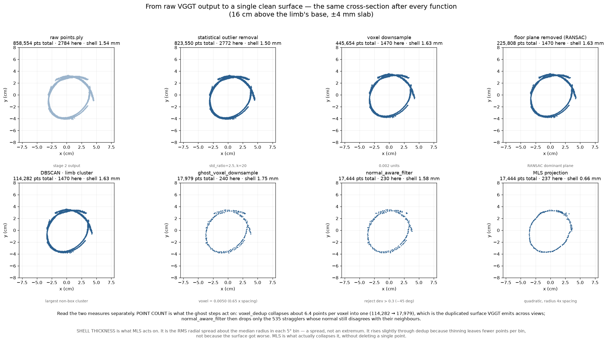
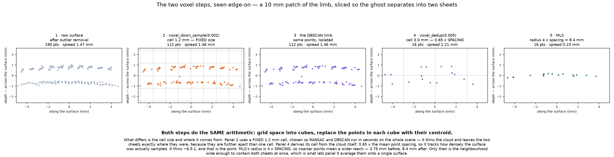

# What changed against `main`

`main` here is `senior-ict/senior` at `bab2bbc` — the pipeline this project
started from. This file lists **what is different now and why each difference is
an improvement**, with the measurement behind each claim.

It is deliberately not a history. It does not describe the order things were
tried, the experiments that failed, or the intermediate designs. Those are in
[`progress.md`](progress.md) — the full working record, including every
derivation — and [`experiments.md`](experiments.md). This file is the answer to
"what is better now, and how do you know".

**The one-line version:** `main` produced a number from any six photographs,
using a reconstruction that never closed, calibrated on the reference's own
volume, and cut wherever a hardcoded colour window happened to land. The current
tree refuses captures it cannot measure, closes the surface and proves it, learns
the marker's colour from the photographs, and will not report a subject's volume
until a person has confirmed where the subject ends.

| | `main` | now |
|---|---|---|
| stages | 6 | 7, two of which stop for a person |
| capture validation | none | Stage 0 gate |
| marker colour | hardcoded khaki window | measured per capture |
| reconstruction | Poisson, never closed | Poisson, **validated at χ = 2**, alpha shape as an automatic fallback |
| reference mesh watertight | **no**, even after repair | **yes**, χ = 2 |
| volume method | `warp+floodfill`, because the mesh never closed | `watertight` — the same Stage 6 code, now reachable |
| where the cut happens | automatic, unreviewable | detected, then confirmed by a person |
| wall clock | 136.7 s | **80 s** |
| front end | none | browser app + GPU service |
| **accuracy against water displacement** | **never measured** | **1.7% mean absolute error, 4 captures** |

---

## 1. A capture can now be refused before any of it is measured

**`main`** handed the photographs straight to VGGT, which centre-crops to a
square and discards **43.8% of a 9:16 phone photo** with no regard for where the
reference cube is. Nothing checked what survived.

**Now** Stage 0 (`pipeline/stages/prep.py`) locates the cube, the limb and the
marker band in every frame, chooses a crop window that holds all of them, and
returns one of three verdicts. **Pass** is a frame whose window exists and holds
everything. **Warning** is a frame that could not be cropped that way but is
still measurable through VGGT's own crop — it is used, and the report names it.
**Reject** is a frame with no cube in it at all, or nothing recognisable; only a
reject stops the run.


**Why this is an improvement.** On `inputs/small_leg`, VGGT's own crop cuts 16%
off the cube in `IMG_4462`. That is invisible: a truncated cube still
reconstructs, it just reconstructs *smaller* — and the cube sets the scale for
every number the run reports. A scale error from a clipped reference cannot be
detected downstream, cannot be corrected, and looks exactly like a correct
result. Stage 0's window keeps 100% of the cube on all five frames it could crop,
and on the sixth it says so instead of measuring it silently.

| frame | cube height (px) | VGGT's own crop keeps | verdict and route | cube kept |
|---|---|---|---|---|
| IMG_4458 | 1487 | 69% | **warning** — a window holding the cube exists, but it leaves the marker band out, so the frame goes to VGGT uncropped | 69% |
| **IMG_4462** | 1150 | **84%** | pass — Stage 0's own window | **100%** |
| the other four | — | 100% | pass — Stage 0's own window | 100% |

`IMG_4458` is the case worth showing: the cube and the band are too far apart for
any square the photo can provide. `main` had no way to notice, and would have
measured the capture and produced a confident number. This one names the file.

**The gate is also guarded against its own detector.** An open-vocabulary model
always returns its best candidate for "cord", so on a capture with no cord it
returns the leg. Three guards, each added after the failure it prevents was
measured (`experiments.md`, E-stage0-verdicts):

- **A band cannot be larger than the limb it is tied to.** Real bands measure
  0.04–0.07 of the limb's area; the false positives measured 1.23–4.02.
- **One detection is not evidence.** A single 74 × 60 px false positive on 1 of 8
  frames once taught the pipeline that the marker was the floor tile, and Stage 3
  cut the limb at 61% of its height on the strength of it. Most of the capture
  must now agree — 4 frames of 6, 5 of 8.
- **A missing band no longer disables cropping.** It used to be a precondition
  for cropping at all, so a capture with no marker silently fell back to VGGT's
  centre crop — the exact failure this stage exists to prevent.

Stage 0 also reads HEIC now. It could not before, and since a phone shoots HEIC
by default, every frame of such a capture was recorded `file unreadable` — all 8
of 8 on `inputs/est_325`, a dataset the gate had therefore never examined.

A rejection carries a severity, because not all of them cost the same thing:

| condition | verdict | what the frame is told |
|---|---|---|
| everything found and framed | **pass** | — |
| band missing | **warning** | marker missing — the cut must be placed by hand |
| band found but clipped | **warning** | marker out of window — the suggested cut may be off |
| cube found but clipped | **warning** | cube out of window — VGGT will centre-crop instead |
| cube not detected | **reject** | cube missing — the scale cannot be recovered |
| nothing detected | **reject** | nothing detected — no cube and no marker |
| file cannot be decoded | **reject** | file unreadable — cannot be decoded |

**A warning is a usable frame.** The distinction is what a defect *costs*. The
reference cube sets the scale of every number, so if it is not detected at all
there is nothing to recover from — that is a reject. Everything else degrades the
result without making it impossible: a clipped cube falls back to VGGT's own
centre crop, and a missing band only means the cut is placed by a person in the
review step, which it is anyway. Only rejects stop the run.

---

## 2. Stage 0's output actually reaches Stage 1

A gate that is computed and then thrown away is worse than no gate, because it
reports success. `stagerun.py 0-6` used to write the crops and then hand VGGT the
**original photographs** anyway.



**Why this is an improvement.** It is the difference between the whole of item 1
working and none of it working. It also closed a discrepancy that had been
recorded as unexplained: the two entry points disagreed by 0.8% on identical
input. They now produce a **bit-identical** `volumes.csv` — `leg_cut.ply` at
`0.00479626174799353` mesh units and `1081.9362025528196 cm³` from both.

---

## 3. The marker's colour is measured from the capture, not assumed

**`main`** detected the band with a fixed hue/saturation window tuned to one
khaki cord. A red or blue band would not have been found at all, and the window
worked on skin only because it happened to exclude *this* skin.

**Now** Stage 0 traces the cord across its detected box — for each column, the
pixel departing furthest from that column's median — and reports the colour, plus
the limb's colour from the same columns. Stage 3 builds a discriminant from the
**contrast between the two** rather than from an absolute hue.



**Why this is an improvement.** Two reasons, and only the second is about
accuracy.

> ### Measured against ground truth, 2026-08-27 — this section overstates what
> the learned colour delivers
>
> On the six Aug 2026 captures the learned path is **refused on every one of
> them** and detection falls back to the hardcoded config window this section
> argues against. The band-to-limb separation it depends on measures 0.021–0.043
> in chromaticity where `small_leg` measures 0.094, and below about 0.05 the
> discriminant selects clothing and floor tile as readily as cord — it put
> champ's grey shorts at 1.54 against the band's own 1.00.
>
> Before that refusal existed the learned path was active, and it was the direct
> cause of four bad cuts. The pipeline's ±1.7% against measured displacement
> comes from the hardcoded window, not from this work.
>
> The mechanism below is still sound and the failure is understood — an olive
> cord on tan skin at 1108 px is a genuinely hard case, and a saturated band
> would roughly triple the separation. But **"a differently coloured cord works
> without a code change" is not demonstrated by any capture in hand**, and on
> this evidence the learned detector has not yet earned its place over the one
> it replaced.

The first is that the detector no longer depends on the marker being khaki. What
is learned is the direction in colour space that separates *this* band from *this*
limb, so a differently coloured cord works without a code change.

The second is that sampling matters. Taking the traced pixel alone reports the
cord's darkest, most shadowed core — a colour the 3D reconstruction never
contains, because a point takes whatever cord pixel its ray landed on. Calibrating
on that extreme discards most of the band: **45 points survive instead of 296**,
and a plane fitted through 45 points scattered along a thin strip tilts **27.1°
from vertical** where the limb itself leans **19.0°**. Sampling ±3 rows around the
trace reports the cord's body, and the plane lands at **19.0°** — matching the
limb's own lean to 0.03°, and matching `main`'s hardcoded detector (19.73°)
without hardcoding anything.

> The earlier write-up quoted this as "20.8° off perpendicular, now 1.3°". That
> derived figure does not reproduce and should not be quoted — it depends
> steeply on how the limb's axis is fitted. The point counts and the tilt above
> do reproduce. See the note in [`experiments.md`](experiments.md).

---

## 4. No volume is produced from a cut nobody agreed to

**`main`** detected the marker, cut the limb there, measured it, and printed a
number. If the cut was wrong, the number was wrong, and nothing in the output
said so.

**Now** Stage 3 runs in two passes. The first (`--no-cut`) detects the cutting
plane, publishes it, and **deliberately writes no `leg_cut.ply`**. A person sees
the complete limb with the proposed plane drawn on it, drags it if it is wrong,
and only then does the second pass (`--cut-only`) apply it and Stages 4-6 measure.

The full shape, including the calibration branch, is
[figure 1 of `../../pipeline/pipeline_flowchart.md`](pipeline_flowchart.md#figure-1--pipeline-spine);
every sub-process is in [`../../pipeline/full_flowchart.md`](../../pipeline/full_flowchart.md).

**Why this is an improvement.** The cut is the one parameter that changes the
answer arbitrarily and cannot be validated from inside the pipeline — where a
limb "ends" is a decision, not a measurement. Deferring it means the reported
volume always corresponds to an extent somebody agreed to.

It is enforced rather than trusted: `service/jobs.py:_postcondition` fails the job
if a `--no-cut` pass leaves a `leg_cut.ply` on disk or a non-reference row in
`volumes.csv`.

Two properties make this cheap enough to be usable:

- **A re-cut costs ~10 s, not a full run.** `leg_open.ply` is the levelled,
  filtered, floor-closed limb saved *before* cutting, so an edit re-runs Stage 3's
  cut and Stages 4-6 only. Stage 1 is never repeated.
- **Applying the detected plane through the two-pass split reproduces an unsplit
  run to the last digit.** The split changed *when* the cut happens, not what it
  computes.

`main`'s cut rule was a centroid-side test. The current rule is explicit about
how many planes it was given: 0 means no cut, 1 keeps what is below it, 2 keep
what lies between them, and more than two are refused because a third can only
contradict one of the first two.

---

## 5. The reconstructed surface closes, which is what makes the volume exact

**`main`** used Poisson. Its reference mesh was **not watertight**, and PyMeshFix
adding 30,739 faces did not close it. An open mesh has no signed volume, so
`main` fell back to flooding a voxel grid — which leaks through any hole and has
no error signal when it does.

**Now** Stage 4 searches α over a ladder from 8× to 200× the point spacing and
takes the **smallest α that is both watertight and has Euler characteristic 2** —
the tightest surface that is still a single closed solid.

Note what did **not** change: Stage 6 is `main`'s code, byte for byte. Its first
tier has always been the exact signed volume, and `main` never reached it because
its meshes were open. The improvement is upstream — the mesh closes, so `main`'s
own best branch is the one that now runs.


| | `main` | now |
|---|---|---|
| method | Poisson, never closed | Poisson, **validated at χ = 2**, alpha shape as automatic fallback |
| reference mesh | 311,821 faces | 16,106 faces |
| watertight | **no** | **yes** |
| after repair | 342,560 faces, **still not watertight** | unchanged, already closed |
| volume | `warp + floodfill` | `watertight`, exact signed volume |

> **Updated 2026-08-23.** This section originally argued for alpha shape over
> Poisson outright. The Poisson column below was measured against a Stage 5 that
> never called `pymeshfix.repair()`; with that fixed, Poisson closes at χ = 2 and
> is now the default, with alpha shape as an automatic per-object fallback for
> the cases it cannot. **What is unchanged is the principle** — χ, not
> watertightness, is what makes a reported volume the volume of a solid — and
> that principle is now enforced twice: Stage 4 falls back when a mesh fails it,
> and Stage 5 warns if one still does. Ball pivoting is rejected either way.

**Why this is an improvement, and why not just use a prettier method.** This is
the change most likely to be questioned, because Poisson and ball pivoting
produce visibly nicer surfaces. So it was measured on the same cloud:



| | fits the points (p95) | after repair | limb volume |
|---|---|---|---|
| ball pivoting | **0.00 mm** — passes through every point | watertight, **χ = 256** | 1410 cm³, **+30.3%** |
| Poisson (PSR) | **1.02 mm** | watertight, **χ = 22** | 1070 cm³, −1.1% |
| alpha shape | 2.39 mm — the *worst* fit | watertight, **χ = 2** | 1082 cm³ |

Ball pivoting fits the data perfectly and is 30% wrong. All three become
watertight after the pipeline's own repair, so **"watertight" is not the property
that matters** — PyMeshFix will happily close a topological mess. χ = 2 is what
separates one closed solid from a bag of shells with tunnels, and it is a
yes/no test rather than a judgement.

Alpha shape is also the **least sensitive to the input**. Removing a few percent
of the cloud moves its volume by 0.03%, against Poisson's 5.8% and ball
pivoting's factor of four — measured in `experiments.md` under E-slice-outliers, and shown
in [`experiments/slice_outlier_removal.png`](experiments/slice_outlier_removal.png).
That matters for a measurement tool: the answer should not depend on which
handful of points survived cleaning.

That is also why the ladder runs to 200×. It used to stop at 90×, and a cropped
limb needs up to 140× on some captures, so the search gave up one rung short and
reported a mesh that never closed.

---

## 6. VGGT's duplicated surface is removed, and by the step that actually removes it

VGGT emits the same surface twice, a couple of millimetres apart. `main` carried
both forward — 120,881 points for the cube where the current tree keeps 19,573.
That is not lost information; it is the same surface described once instead of
two-and-a-bit times.



Three functions, now all in `pipeline/ghost.py`, doing genuinely different jobs:

| function | what it does | what it does **not** do |
|---|---|---|
| `ghost_voxel_downsample` | sets the point spacing — 114,282 → 17,979, ~6.4 points per voxel | **does not remove the ghost.** Two sheets 2 mm apart fall in different voxels and both survive |
| `normal_aware_filter` | drops points whose normal disagrees with their neighbourhood, 17,979 → 17,443 | not load-bearing: −0.08% on the volume |
| `mls_project` | **collapses the two sheets onto one**, shell 1.76 mm → 0.79 mm | does not delete anything — it moves points |



**Why this is an improvement.** A doubled surface inflates every reconstruction
built on it. Removing `ghost_voxel_downsample` costs **+2.59%** on the reported limb volume
(1081.94 → 1111.62 cm³ with `GHOST_VOXEL_FACTOR = 0`, same cached Stage 1) —
larger than the reference cube's own residual, so it is not noise.

The mechanism is worth stating precisely because it was mis-attributed twice:
`MLS_RADIUS_MULT` is measured in **multiples of point spacing**, so decimating is
what converts it into millimetres. 0.94 mm spacing gives a 3.75 mm radius, 2.10 mm
spacing gives 8.38 mm, against a ~2 mm sheet separation. Dedup is what buys MLS a
neighbourhood wide enough to span the ghost; MLS is what closes it.


> The outline panel in that figure traces the **maximum** radius per angular
> wedge, which is why it shows corners a leg does not have and why its area
> percentages are inflated. Corrected in
> [`experiments/outline_statistic.png`](experiments/outline_statistic.png); the
> scatter panels and shell-RMS column are unaffected.

The fit is quadratic rather than planar for a measured reason: both flatten the
shell equally (0.77 mm vs 0.79 mm), but a plane fitted to a curved surface sits
inside it and pulls the outline inward. Measured across 40 cross-sections, the
quadratic preserves **+1.10 pp** more area than the plane — positive in **100%**
of them, and stable at +1.0 to +1.2 pp under every way of tracing the outline
([`experiments/outline_statistic.png`](experiments/outline_statistic.png)). On a
limb that propagates straight into the volume.

---

## 7. Stage 3 clusters before it filters

**`main`** filtered the cloud and then clustered it. **Now** the dense cloud is
segmented first — floor removal, then DBSCAN — and each identified cluster is
ghost-filtered separately.

**Why this is an improvement.** Two things depend on it:

- **Clustering has better statistics on the dense cloud.** Deciding which cluster
  is the reference is a shape judgement (`cubeness = min_extent / max_extent`),
  and thinning the cloud first degrades exactly the evidence it uses.
- **Marker detection is a colour test**, and thinning throws away the sparse
  coloured points it depends on. Detecting on the dense cluster is what makes the
  band findable at all.

Splitting before filtering also keeps point identity, so no label transfer is
needed afterwards.

Levelling then applies one rotation `R_total` to every sub-cloud **and to the
detected marker planes**. This is not cosmetic: the planes are detected before
levelling and the meshes are written after, so a plane that misses the rotation
is expressed in a frame the meshes do not share. That is why the pipeline
publishes `cutting_line_levelled.json` and the web app reads that file and never
the unlevelled one.

---

## 8. A stage can be re-run without redoing inference

**`main`** had one entry point that ran everything. **Now** `stagerun.py` runs any
stage or range, caching each stage's output under `work/<name>/`:

```bash
python stagerun.py 1 -i inputs/est_325 --name est_test    # ~19 s, cached after
python stagerun.py 2-6 --name est_test                    # seconds
python stagerun.py 4-6 --name variant --src est_test --obj-recon-method poisson
```

**Why this is an improvement.** Every measured claim in this file exists because
of it. Testing whether `ghost_voxel_downsample` matters means running Stages 3-6 twice with
one constant changed; under `main` that was two full runs including two VGGT
passes. `--src` branches a variant from another run's cached stage, so an
experiment costs seconds. Each stage also writes a `summary.txt` with point
counts, extents, watertightness and volumes, and Stage 1 writes `raw/` — every
model output as PNG, PLY and JSON — so what VGGT produced can be looked at rather
than inferred.

---

## 9. There is a browser front end, and it drives the real pipeline

**`main`** was a command line only. **Now** `./serve.sh` starts a Next.js app and
a FastAPI service that runs the actual `stagerun.py`.

Upload 6-12 photos from a phone, read the framing verdicts with the overlays,
continue or re-take, watch the stages advance, drag the cutting plane in 3D, and
get the volume.

**Why this is an improvement.** The two decisions this pipeline defers to a
person — is this capture usable, and where does the subject end — are both
*visual*. A terminal cannot show someone that the cube is clipped in frame 5, or
let them see that the proposed cut runs through the ankle. The gates from items 1
and 4 only function if there is somewhere for a person to look.

Some properties worth knowing:

- Each stage runs as its own **subprocess**, which is what lets the service report
  which stage is in flight without parsing logs, and guarantees VRAM is released
  between stages rather than accumulating across jobs.
- A job is a `work/<job_id>/` directory — the same layout every manual run uses —
  so anything the service produced can be inspected or re-run from a terminal.
- Dragging a plane recomputes a **preview** in the browser for immediate feedback,
  but the reported number always comes from the pipeline re-running.
- Nothing is sent anywhere. VGGT runs on the local GPU.

---

## 10. Smaller things that change a number or prevent a wrong one

| change | why it is an improvement |
|---|---|
| **Watertightness verified with `trimesh.load(process=False)`** | the default merge welds PyMeshFix's intentional seam duplicates and reports an *open* mesh as watertight. The check was passing on meshes that were not closed |
| ~~**Marker detection restricted to the upper 60% of the limb's span**~~ | **WITHDRAWN 2026-08-27 — this was never implemented.** The only height rule in the code was `MARKER_MIN_HEIGHT_FRAC`, a floor at 20% of the span, and a floor cannot do what this row claims. It has since been replaced by a floor measured in reference-cube heights, plus a perpendicular-to-the-limb gate, both in `pipeline/stages/clean.py`. |
| **The alpha ladder reports its fallback** | when no rung is both closed and χ = 2 it ranks candidates and says so, instead of silently returning something open |
| **`--seed` seeds `random`, NumPy, PyTorch and Open3D** | Stage 3 is reproducible bit-for-bit, which is what makes an A/B of one constant meaningful |
| **Licence handling is explicit** | the default checkpoint is gated; without a token the pipeline falls back **loudly** to `facebook/VGGT-1B`, which is CC BY-NC-SA and not licensed for commercial use. `main` had no such notice |
| **`pipeline/mls.py` merged into `pipeline/ghost.py`** | the three ghost steps are only legible together — the division of labour in item 6 is the thing most often got wrong, and splitting the file across two modules hid it. Verified behaviour-neutral: bit-identical `volumes.csv` before and after |

---

## 11. A limb can be measured below one band or between two, and the run works out which

**`main`** — and this branch until now — read the number of cuts off the config
constant `MARKER_CUT_MODE`, which meant a two-band capture and a one-band capture
could not be measured in the same session without editing a source file between
runs.

**Now** the default is `--cut-mode auto`: `upper` measures everything below the
highest valid band, `span` measures the segment between the outermost two, and
auto picks span exactly when two marker planes survive Stage 3's height and
perpendicularity gates. `inputs/champ` resolves to span, `inputs/small_leg` to
upper, with no flag either way.

**What auto reads, and what it deliberately does not.** The gated plane count
decides, because those gates are the measured discriminator — genuine bands sit
2.4-27 degrees off the limb's axis, planes fitted to shorts and floor junctions
53-89 — and a plane is the only thing that can actually cut. Stage 0's band
count is a cross-check that gets printed, not a veto, because it is measured to
under-count (below).

**Stage 0 now counts the bands rather than taking the detector's best box.**
`core/vlm_detect.py:detect_all` returns every box over threshold with IoU
suppression; `prep.py` keeps those that sit on the limb, are small against it,
and are separated from each other; the crop window is sized to hold **all** of
them, and `framing.json` carries `bands` plus a per-frame `bands_seen`. A capture
wears two bands when BAND_MIN_FRAME_FRAC of its frames say so — the same
corroboration rule the band colour already used.

Measured: `champ` 2 bands on 8 of 8 frames, `small_leg` 1 on 6 of 6, `est_325`
0. Framing on the one-band and no-band captures is **byte-identical** to before;
on `champ` one frame's window moved 55 px to take in the lower band, and all
eight verdicts are unchanged.

**Where it does not work, stated plainly.** `inputs/sunshine2` wears an ankle
cord and a below-knee cord, and the detector returns the upper one on 1 frame of
8 — below the bar, so Stage 0 reports one band. Stage 3 finds one plane there
too, so auto measures below the ankle cord. Two ways of forcing the upper cord
out were tried and both were rejected on measurement: a second detector pass over
the limb above the first band, and a search for the primary band's own traced
colour. Each produces "second bands" on one-band captures at the same rate as on
real two-band ones, which is worse than under-counting: it would silently change
which quantity a run reports.

**The cut no longer depends on the cord being a separable colour.**
`core/bands3d.py` projects Stage 0's band boxes through Stage 1's own pointmap
and fits a plane to the 3D points that come back, as a second source merged with
colour detection inside Stage 3. On the web job that prompted it — two cords,
band/limb separation 0.0259 against the 0.05 floor, so the learned colour was
refused — colour found one plane and the lower cord survived only as an 11-point
cluster that the 40-point floor dropped. Projection recovers it from 1,842 points
across 6 frames, and the run now cuts at 18.7% and 72.4% of the limb's span.

It is additive by construction: a projected plane within `SAME_BAND_DISTANCE` of
a colour plane is the same band, and the colour fit wins. `champ` (colour already
found both bands) and `small_leg` (one band) produce point-for-point identical
cuts. Projected planes are exempt from the height floor, which exists to reject
uncorroborated blobs near the ground and would otherwise throw away a real ankle
cord at 0.66 cube heights; the perpendicularity gate still applies to everything.
It cannot rescue a band Stage 0 never saw — `sunshine2` still reports one.

**Selecting no longer discards.** `cutting_line_levelled.json` carries
`candidates` — every plane that passed the gates, lowest first — beside
`markers`, which keeps its old meaning of *the planes this run cut on*, and
`cut_mode`. The review screen seeds from `candidates`, so a reviewer sees both
bands of a two-band capture whatever the run cut on, and the candidates travel
into `cutting_line_review.json` so they survive a re-cut.

Stage 6's circumference reads the review's planes when a review happened, and
the detected ones otherwise. It previously always read the detected file, so
after a re-cut it reported a circumference at a plane the measured mesh had not
been cut at.

**The review screen measures girth while you drag.** Each plane's panel shows
the circumference where it crosses the limb, in centimetres, recomputed on every
move — the same ellipse fit Stage 6 prints, ported to TypeScript in
`web/src/lib/crosssection.ts` and checked against the Python on a real slice to
every digit displayed, and against a synthetic ellipse of known axes to 1e-8.
The diagnostics are shown beside it rather than hidden: ring coverage, radial
residual, and the independent polygon cross-check. An algebraic fit to half a
ring returns a plausible number with a *better* residual than the truth, so a
panel showing only centimetres would make that failure look like a measurement.
It is what lets a reviewer put the cut at a height they have a tape measurement
for and compare on the spot.

**This changes a published number.** The accuracy table was measured
foot-to-upper-band. `champ` wears two bands, so under the new default it reports
the segment between them (~2377 cm³) instead of 3354 cm³. Reproducing the table
needs an explicit `--cut-mode upper`; the README says so where the table is.

---

## What has **not** improved, and should not be claimed

Stated here so this file cannot be read as more than it is.

- ~~**There is still no independent ground truth.**~~ **Closed 2026-08-27.**
  Water displacement on five limb captures now exists, and the pipeline reads
  **1.7% mean absolute error** on the four that resolve. See
  [`progress.md`](progress.md) session log, 27 August. What replaces this
  caveat is a narrower one: n = 4, one subject class, one floor, one cord
  colour, and every figure conditional on the printed cube really being
  10.00 cm.
- **One capture is unresolved.** `champ` reads +19.4% with a cut 2.4° off the
  limb's own axis and the most square cube in the set, and its 2.81 L matches
  neither segment its two bands bound. Not the cut, not the reference, not
  surface noise.
- **One capture is unusable.** `inputs/blue shirt` — VGGT's reconstruction is
  wrong. It produced a confident number with every gate passing, which is what
  prompted the reference-fill check now in Stage 6.
- ~~**Stage 6 is reverted to `main`'s version**, pending review.~~ **Resolved
  2026-08-27: `main`'s version stays**, on measurement — 1.7% mean absolute
  error against 4.1% for the parked fitted-face method. The epistemic objection
  below still stands; the error bar now comes from held-out objects instead.
  Original text follows.

- **Stage 6 is reverted to `main`'s version**, pending review by that stage's
  author. So the scale is still derived from the reference cube's own volume,
  which means **the cube reports exactly 2744.00 cm³ on every run — an identity,
  not a measurement** — and dimensions still come from an axis-aligned box, so
  the 14 cm cube reads 19.18 × 19.47 × 14.09. The alternative is parked as a
  commented block in `pipeline/stages/volume.py`. See
  [`stage06_experiments.md`](stage06_experiments.md).
- **`REFERENCE_REAL_SIZE_CM = 14.0` has never been measured.** The cube is
  handmade cardboard; a 2 mm build error is 1.4% linear = 4.3% volume on every
  result — larger than most of the improvements above.
- **The marker-colour work is validated on one capture.** `small_leg` only.
  `est_325` has no band. That a *learned* colour generalises to a red or blue
  marker is argued from the mechanism, not demonstrated.
- **Three silent failure paths remain**, listed as open items 3, 4 and 5 in
  [`../../reviews/repo_review.md`](../../reviews/repo_review.md). One of them makes the Stage 0 gate *more*
  permissive if a detector throws.
- **`--no-prep-crop` is ignored on the `run.py` path** — parsed, never passed to
  `prepare_frames`. Item 11 in the same file.
