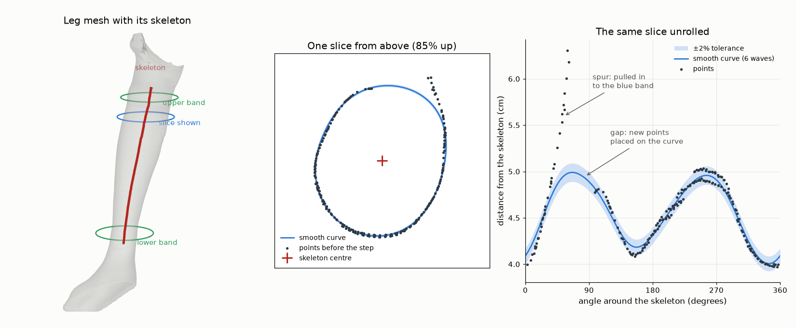
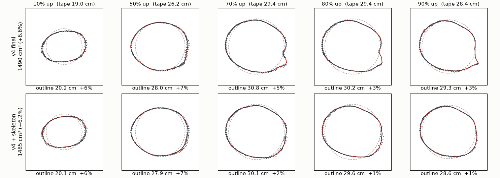
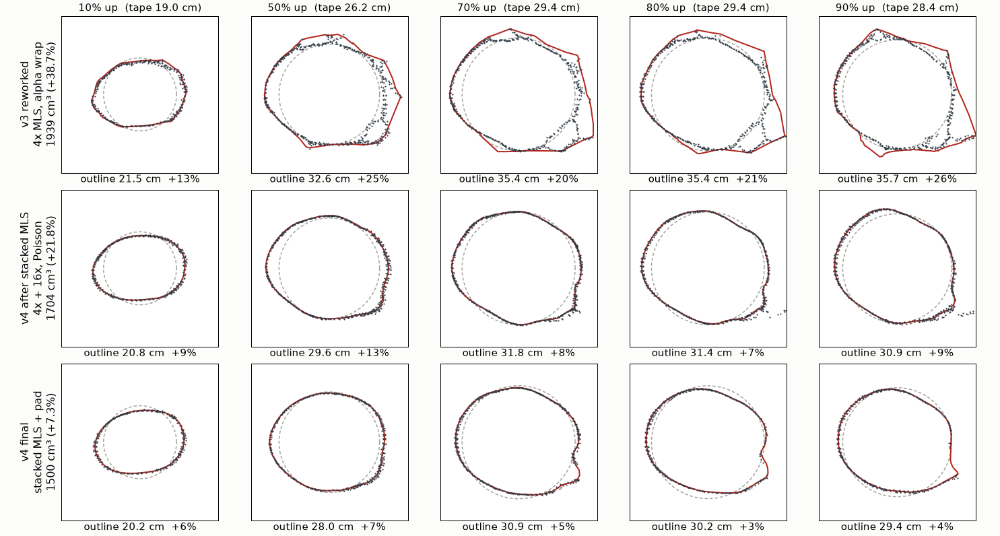

# The pipeline as it stands, 21 September 2026

Limb-segment volume from phone photos: about eight photos of a limb wearing
two green bands, standing next to a 10 cm ArUco cube, give the volume of the
limb between the bands. This document describes what the code on
`keng-branch` does today (version 4 with the limb skeleton step), stage by
stage. It replaces the parts of `pipeline.md` that have gone out of date: the
photos are now padded, not cropped; the cut is made on the mesh in Stage 5;
the cube is 10 cm, not 14 cm.

## At a glance

```
photos (about 8, phone, 9:16)
  [0] Framing        find cube, limb and bands; refuse unusable photos
  [1] VGGT           whole photo, padded to 518 px; one 3-D point per pixel
  [2] Point cloud    keep confident pixels, drop the white padding
  [3] Clean          separate cube and limb, stacked MLS, level to the floor,
                     find the band planes, limb skeleton, close the ends
  [4] Mesh           Poisson surface; alpha shape if Poisson is not one solid
  [5] Watertight+cut repair to a closed solid, then cut between the bands
  [6] Volume         scale from the cube's volume; limb volume, girths
```

| stage | time on test6 |
|---|---|
| 1 VGGT | 17 s |
| 2 point cloud | under 1 s |
| 3 clean | 8 s |
| 4 mesh | 16 s |
| 5 watertight and cut | 4 s |
| 6 volume | under 1 s |
| whole run, including Stage 0 and loading the models | 85 s |

Current accuracy, volume between the bands against water or tape:

| capture | truth (cm³) | pipeline (cm³) | error |
|---|---|---|---|
| test6 | 1398.6 tape | 1485.2 | +6.2% |
| test5 | 2070 water | 2167.6 | +4.7% |
| 0_right | 1830 water | 1743.5 | −4.7% |
| 1_left | 1600 water | 1591.1 | −0.6% |
| 6_left | 2800 water | 2647.2 | −5.5% |
| 2_left | 1050 water | 1180.2 | +12.4% |
| **mean error, ignoring sign** | | | **5.7%** |
| **mean error, with sign** | | | **+2.1%** |

These are Stages 3–6 rerun with the skeleton step on, from the padded runs'
Stage 0–2 output. The previous version, which cropped each photo, averaged
29%.

## Stage 0 — Framing

**Code:** `pipeline/stages/prep.py`, `prepare_frames()`

For every photo:

- **Cube:** found by its ArUco markers (`DICT_5X5_250`), each marker's quad
  grown to the whole cube face, joined with a GroundingDINO box.
- **Limb and bands:** GroundingDINO boxes and SAM masks. Every band box that
  sits on the limb is kept, up to two.
- **Band colour:** measured from the photos and handed to Stage 3, which uses
  it only when the band and the skin are different enough in colour.
- **Gate:** a photo with no cube at all, or with nothing detected, or that
  cannot be read, is rejected and stops the run (unless
  `--continue-on-rejected`). A missing or clipped band is only a warning.

**No crop.** Stage 0 used to cut each photo to a square that slid up or down
to fit the cube and bands. That moved the photo's optical centre 19–74 px away
from the middle of the square, while VGGT assumes the centre is the middle,
and the whole reconstructed scene came out distorted. Stage 0 now detects and
gates only, and hands the whole photo on (`FRAME_FIT = "pad"`). This one
change took the mean error from 29% to about 6%.

**Output:** `framing.json` (band count, band colour), `manifest.json` (per
photo: boxes, verdict).

## Stage 1 — VGGT

**Code:** `pipeline/stages/inference.py`, `run_inference()`

One pass of VGGT-1B over all the photos together. Each photo is shrunk to
fit a 518 px square, whole, with white padding above and below (VGGT's own
`pad` mode). For every pixel of every photo VGGT predicts a 3-D point in one
shared scene, and how confident it is. Those points (`world_points`) are the
only geometry the rest of the pipeline uses.

- **Checkpoint:** `facebook/VGGT-1B-Commercial`, the commercial licence
  (`VGGT_USE_COMMERCIAL = True`). It is gated on Hugging Face; without a login
  the loader falls back, loudly, to the non-commercial weights.
- **Resolution:** fixed at 518. Larger inputs (1022) were tested and are much
  worse; the model was trained at 518.

**Output:** `predictions.npz`

## Stage 2 — Point cloud

**Code:** `pipeline/stages/pointcloud.py`, `export_ply()`

1. Keep pixels above the 45th confidence percentile (`--conf_thres 45`), with
   an absolute floor for photos where most pixels sit at the minimum.
2. Drop every pixel of the white padding: VGGT still predicts a point there,
   and it has no geometry.
3. Remove spatial outliers.

TSDF fusion of the depth maps is available as an alternative
(`POINTCLOUD_METHOD=tsdf`) but is off: it was not more accurate.

**Output:** `points.ply`

## Stage 3 — Clean

**Code:** `pipeline/stages/clean.py`, `clean_and_extract()`

**Separate the objects** (in VGGT's own coordinates)

1. Outlier removal, then thinning on a small voxel grid, for speed.
2. Remove the floor plane, so the objects do not join through it.
3. DBSCAN into clusters; the cube is the one that looks most like a cube with
   black and white faces, the limb is the other.
4. Find the band planes two ways: by colour on the dense limb, and by
   projecting Stage 0's band boxes through VGGT's points into 3-D. The
   projected planes only add; where both find a band, the colour plane is
   used and the projected one is kept as its backup.

**Clean each object on its own**

5. Ghost-voxel downsample (voxel 2.8 times the point spacing) and a filter
   that drops points whose normal disagrees with their neighbours.
6. **Stacked MLS.** VGGT gives the skin twice, as two sheets a few mm apart,
   because different photos place it slightly differently. MLS moves each
   point onto a smooth patch fitted to its neighbours inside a ball: first a
   ball of 4 point spacings (1.1 cm on `test6`), then, for the limb only, 16
   spacings (2.6 cm), wide enough to reach both sheets and merge them into
   one. See `docs/pipeline/mls_explained.md`.

**Level and finish**

7. Fit the floor, rotate so it is flat and height is straight up, and drop
   anything below it.
8. Gate the band planes: a colour plane must sit at least one cube height
   above the floor, and every plane must lie within 35° of square to the limb. With two planes left, the measurement is the
   segment between them.
9. **Limb skeleton** (on by default). Between the bands, the limb is cut into
   60 horizontal chunks (0.53 cm tall on `test6`), each chunk's points are
   seen from above as a ring, and one smooth curve is fitted around the
   chunk's centre. Points far outside it (spurs) are moved in, points far
   inside (dents) moved out, and empty arcs are filled on the curve. Section
   below; full account in `docs/pipeline/limb_skeleton.md`.
10. Close the limb: sweep its bottom down to the floor, cap the bottom, cap
    the open top. The limb is **not cut here**.

**Output:** `objects/leg.ply`, `objects/box.ply`, and the band planes in
`debug/cutting_line_levelled.json`

## The limb skeleton step



- **Chunks:** 0% is the lower band's height, 100% the upper band's; 60 chunks
  run from −8% to 108%. Inside a chunk, height is ignored.
- **Skeleton:** each chunk's centre from a circle fit, smoothed up the leg.
- **Curve:** walking once around the centre, the distance to the skin rises
  and falls; the curve is the average distance plus up to six waves (two per
  turn makes an oval, three a rounded triangle). Higher waves are held back,
  and the fit is repeated three times without the points furthest from it,
  so a spur cannot pull the curve toward itself.
- **Unusual points:** further than 2% of the radius (about 1 mm) from the
  curve. They move only to the edge of that band, so real skin texture stays.



## Stage 4 — Mesh

**Code:** `pipeline/stages/reconstruct.py`

Poisson surface reconstruction for both the cube and the limb. After each,
the same repair Stage 5 will run is tried and the result's Euler
characteristic checked: a single closed solid has χ = 2. If Poisson's mesh is
not (a closed surface with tunnels still counts as "watertight", so that test
alone is not enough), that object alone is rebuilt with an alpha shape, whose
ladder of sizes is chosen to give χ = 2.

**Output:** `mesh/box_recon.ply`, `mesh/leg_recon.ply`

## Stage 5 — Watertight and cut

**Code:** `pipeline/stages/watertight.py`, `pipeline/core/meshcut.py`

1. Repair each mesh to a closed solid with PyMeshFix (skipped when it is
   already closed). The uncut limb is published as `leg_no_cut.ply`.
2. **Cut the limb** at the band planes: two planes keep what lies between
   them, one keeps what lies below it. Slicing a closed solid gives the flat
   end faces directly, with no reconstruction step after the cut that could
   round them off. This is also the surface a person can move the cut on in
   the web review.

The cut can instead be made on the point cloud in Stage 3
(`CUT_STAGE=cloud`). On the six captures the two agree within 8 cm³ on five,
and the cloud cut is further from water on the sixth, so the mesh cut stays.

**Output:** `mesh/leg_no_cut.ply`, `mesh/leg_cut.ply`, `mesh/box.ply`

## Stage 6 — Volume

**Code:** `pipeline/stages/volume.py`, `compute_volumes()`

- **Scale from the cube's volume.** The cube is 10 × 10 × 10 cm
  (`REFERENCE_REAL_SIZE_CM`), so its mesh must be 1000 cm³; the ratio gives
  cm³ per scene unit, and its cube root cm per unit. The printed 5 cm markers
  were tried as a second scale and dropped: VGGT does not place their corners
  well enough, and a ruler agreed with the cube.
- **Cube checks, two of them.** An ideal cube is fitted to the reference
  *points* (`pipeline/core/cube_fit.py`): its residual says whether the cube
  reconstructed as a cube, and a residual past 3 mm warns that the capture
  itself is bad. Across seven captures the residual ran 0.7–1.5 mm, and the
  fitted side agreed with the mesh-volume scale to about 1%, so the fit is a
  cross-check and does not set the scale. The older check, how much of its own
  box the cube's *mesh* fills, is still printed; it warned on four of those
  seven captures, which the fit showed was the alpha wrap's doing rather than
  the capture's.
- **Voxel cross-check:** each closed mesh is also measured by filling a voxel
  grid. Counting boundary cells whole puts that a few percent above the exact
  volume, so a voxel result *below* the exact one means the surface is
  inverted or self-intersecting, and the run says so.
- **Limb volume:** the exact enclosed volume of the closed `leg_cut.ply`.
  Voxel counting is only a fallback for a mesh that is not closed, and warns
  when used.
- **Girth at each band:** the limb's points in a ±4 mm slab at each cut plane,
  an ellipse fitted to them, and its perimeter. This is the one number a tape
  measure can check without water.

**Output:** `volumes.csv`; the run's final meshes in the output folder.

## How it got here



| version | date | what changed | mean error |
|---|---|---|---|
| v1 | main | VGGT's centre crop, one band, cut on the cloud | not comparable |
| v2 | 12–24 Aug | Stage 0 framing; Poisson with alpha fallback | — |
| v3 | 31 Aug | cut moved to the mesh in Stage 5; two bands | 31% on five captures; 2_left lost a band (+222%) |
| v4 | 18–21 Sep | second MLS pass, ghost-voxel spacing fix, projected band planes as backup (29% while still cropping), then **pad instead of crop**, marker-scale check removed, limb skeleton | 5.7% |

## What is still open

- **Length on `test6`.** The leg reads 28.87 cm between the band centres
  against a 27.5 cm ruler (+5%), most of `test6`'s error. Whether the ruler
  was read between band centres or inner edges is not yet known.
- **`2_left` at +12%.** Its band girths match the tape almost exactly, so the
  extra is in length or in the water truth.
- **How repeatable the truth and the pipeline are.** Three captures and three
  water measurements of one limb would say how much of the 5–6% is noise.
- **Six captures** are too few to separate a +2% bias from scatter.

## Running it

```bash
python run.py -i inputs/test6                  # the whole pipeline
python stagerun.py 3-6 --name test6_try        # rerun Stages 3-6 on work/test6_try
LIMB_SKELETON=off python run.py -i inputs/test6   # without the skeleton step
FRAME_FIT=crop python run.py -i inputs/test6      # the old cropped input
CUT_STAGE=cloud python run.py -i inputs/test6     # cut the cloud in Stage 3
```

Outputs land in `output/` (or `--output_dir`), with every stage's files under
`for_debug/00_prep` to `for_debug/06_volume`; `stagerun.py` writes to
`work/<name>/` instead.
