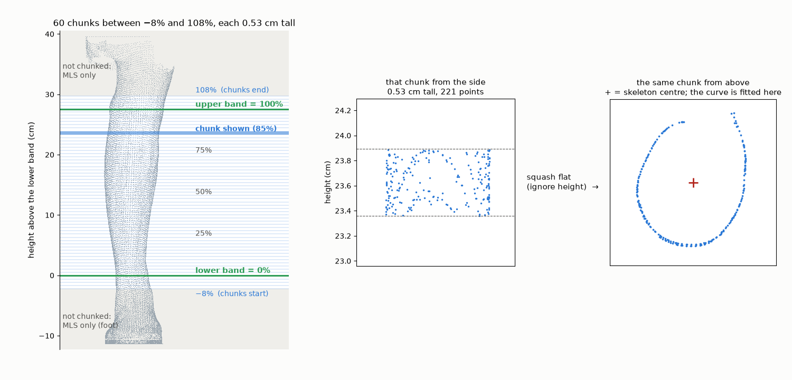
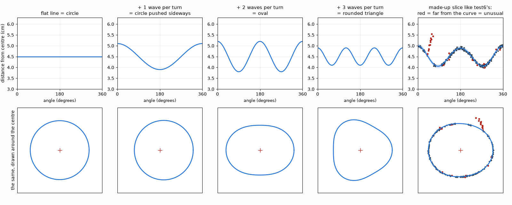

# The limb skeleton step, in full

What Stage 3's limb skeleton step does, why it is there, and how it decides
what to move. The implementation is
[`pipeline/core/limb_skeleton.py`](../../pipeline/core/limb_skeleton.py), called
from `pipeline/stages/clean.py` just before the limb is closed at the floor and
the top. It is on by default; `LIMB_SKELETON=off` turns it off.

Every number below is from `test6` (the padded run, 21 September 2026) unless
it says otherwise.

---

## 1. The problem it fixes

After the stacked MLS passes the limb's point cloud is one clean sheet almost
everywhere, but two flaws survive, and Poisson (Stage 4) turns both into wrong
shape:

- **Spurs.** Where a camera sees the skin side-on, at the edge of the leg in
  that photo, VGGT's points streak outward as a tail. The tail is a tight
  bunch of points that agree with each other, so MLS smooths it but keeps it.
- **Gaps.** An arc of the leg that no frame reconstructed cleanly is simply
  missing. On `test6` near the upper band the frames disagree about that arc,
  and the gap is already in the leg cluster before any cleaning, so no
  cleaning step causes it and none can fill it. MLS only moves points; it
  cannot add them. Poisson then bridges the hole with a flat patch.

In the ring gallery this was the flat side and the red spur at 70–90% of the
way up (the top row below).

## 2. Why MLS cannot do this, and this step can

MLS and this step look at the limb in different ways.

| | MLS (stacked, 4x then 16x) | Limb skeleton |
|---|---|---|
| What it looks at | a **ball** around each point, in 3-D | a **ring**: one horizontal chunk of the limb, seen from above |
| Size | ball radius 1.1 cm, then 2.6 cm on `test6` | chunk 0.53 cm tall, the whole way round |
| Needs chunks? | no: the ball already covers all three directions | yes: the ring shape only exists within one height |
| Where it runs | the whole limb, foot included | only between the bands, with a small margin |
| Can see a spur is wrong? | no: from inside the ball the spur looks like surface | yes: it does not fit the ring's shape |
| Can fill a gap? | no: it only moves existing points | yes: it adds points on the ring's curve |

So MLS cleans the surface first, everywhere, and this step then fixes the
ring shape between the bands.

## 3. The chunks, and what "0% to 100%" means

The limb is levelled first (Phase B of Stage 3), so the floor is flat and
height is straight up. Then:

- **Positions are given as a percentage between the bands**, measured straight
  up: **0%** is the lower band's height, **100%** is the upper band's height,
  50% is halfway. On `test6` the bands are 27.5 cm apart vertically, so 1% is
  about 0.27 cm.
- **The chunks run from −8% to 108%**, a little past each band, so the
  surface is already smooth exactly where Stage 5 cuts.
- **There are always 60 chunks** across that range, so their height depends on
  the limb: 0.53 cm on `test6`.
- **Each chunk is a horizontal layer**, cut by height, not tilted to follow
  the leg.
- **Inside a chunk, height is ignored.** Every point in the chunk is squashed
  flat onto the floor plane and drawn as one ring (right panel above: 221
  points).
- Above 108% and below −8%, the foot included, nothing is chunked; those
  parts get MLS only. The foot could not use this step anyway (section 7).

## 4. The skeleton

Each chunk needs a centre to measure from.

1. **One centre per chunk** from a least-squares circle fit through the
   chunk's points (`fit_circle_centre`). Not the average of the points: a gap
   on one side would pull the average toward the other side, while the circle
   fit is decided by the arc that is there.
2. **Smoothed up the leg** with a moving median over 5 chunks
   (`moving_median`), so one bad chunk cannot make the line jump.

That smoothed line of centres is the skeleton: the red line in the left
panel above. Both steps are in `slice_skeleton`.

## 5. The curve

This is the part that decides what is normal for each ring.

### Unroll the ring

Stand at the skeleton centre and turn once around. At each angle, note how
far away the skin is. Plotting distance against angle turns the ring into a
wavy line (right panel of the figure above).

- A **circle** is the same distance everywhere: a flat line.
- An **oval** is far at the two long ends and near at the two sides, so going
  once around you meet far, near, far, near: **two bumps per turn**.
- A **rounded triangle** has three far corners: three bumps per turn.
- A circle **pushed off-centre** is far on one side and near on the other:
  one bump per turn.

"Waves" are just those bumps. The number of bumps per turn sets the kind of
shape and their height sets how strong it is. Adding a few together makes any
smooth limb shape; an oval with one slightly flat side is two big bumps plus
a small three-bump wave.

### Fit the waves

The curve is the average radius plus waves of 1 to 6 bumps per turn
(`fourier_columns`). The fit (`fit_smooth_curve`) picks the size of each wave
so the curve passes as close as possible to the chunk's points, with three
rules:

1. **At most six waves.** Six bumps per turn cannot make a sharp spike, so
   the curve cannot follow a spur.
2. **Higher waves cost more.** Each wave is penalised by its bump count to the
   fourth power (`HARMONIC_DAMPING`). An oval is nearly free; the fifth and
   sixth waves are heavily held back. This matters most across a gap, where
   there are no points: the curve takes the calmest path instead of swinging.
3. **Refit without the far points.** The fit is done three times; after each,
   points more than 2.5 times the typical scatter from the curve are left out
   of the next fit, so a spur cannot drag the curve toward itself.

It also uses the chunks just above and below, measured from this chunk's
centre, so a chunk with a gap borrows shape from its neighbours.

For the chunk shown in the figures (85% up on `test6`):

| part of the curve | size | shape it adds |
|---|---|---|
| average radius | 4.55 cm | a circle |
| 1 bump per turn | 0.60 mm | pushed slightly off-centre |
| 2 bumps per turn | **4.39 mm** | **an oval** |
| 3 bumps per turn | 0.47 mm | slight three-sided flattening |
| 4 bumps per turn | 0.20 mm | almost nothing |
| 5 bumps per turn | 0.16 mm | almost nothing |
| 6 bumps per turn | 0.05 mm | almost nothing |

So this ring is an oval, 4.55 cm ± 4.4 mm.

| refit round | points used | typical scatter |
|---|---|---|
| 1 | 655 (the chunk and its two neighbours) | 0.99 mm |
| 2 | 625 | 0.94 mm |
| 3 | 611 | 0.94 mm |

The 44 points left out are mostly the spur.

## 6. What happens to the points

Around the curve is a band of ±2% of the radius (`RADIUS_TOLERANCE_FRACTION`),
about 0.9 mm here. **A point is unusual when it sits outside that band.**

- **Outside the band (outer defect: a spur or bulge):** moved in, to the
  band's outer edge.
- **Inside the band (inner defect: a dent):** moved out, to the band's inner
  edge.
- **Within the band:** left alone.

Points go only to the edge of the band, not onto the curve, so the skin keeps
its fine texture and only the outliers change. In the chunk above, 24 points
were moved in, 16 moved out, and 181 were not touched.

**Gaps.** Angles are checked in 5° steps (`empty_arcs`). An empty run of up to
120° is filled with new points placed on the curve, as densely as the rest of
the ring. Wider gaps are left alone: with that little of the ring there, the
curve is a guess.

On the whole of `test6` the step moved 2,130 points in, 1,057 out, and added
466 points in 94 empty arcs across the 60 chunks.

## 7. Limits

- **Sharp edges get slightly rounded.** Six waves cannot make a corner. If the
  shin bone's front edge is sharper than that, points on it can be pulled in
  by up to the 2% band, about 1 mm.
- **It needs one radius per angle.** Each direction from the skeleton must
  cross the skin once. That holds for a shin, calf or thigh between the bands,
  but not for a foot or a bent knee, which is why the step stops at −8% and
  108%.
- **It fixes shape, not length.** Nothing in it changes where the bands are,
  so the length error on `test6` (28.87 cm along the leg against the 27.5 cm
  ruler) is untouched.

## 8. What it did to the volumes

Stages 3–6 rerun on the six padded captures, step off and on, from the same
Stage 0–2 output (`work/<capture>_skel_off`, `work/<capture>_skel_on`):

| capture | truth (cm³) | off | on |
|---|---|---|---|
| test6 | 1398.6 tape | 1490.4 (+6.6%) | 1485.2 (+6.2%) |
| test5 | 2070 water | 2165.8 (+4.6%) | 2167.6 (+4.7%) |
| 0_right | 1830 water | 1734.5 (−5.2%) | 1743.5 (−4.7%) |
| 1_left | 1600 water | 1612.0 (+0.8%) | 1591.1 (−0.6%) |
| 6_left | 2800 water | 2648.8 (−5.4%) | 2647.2 (−5.5%) |
| 2_left | 1050 water | 1179.4 (+12.3%) | 1180.2 (+12.4%) |
| **mean error, ignoring sign** | | **5.8%** | **5.7%** |
| **mean error, with sign** | | **+2.3%** | **+2.1%** |

The rings are clearly cleaner: on `test6` the outline against the tape went
from +3–5% to +1–2% at 70–90% of the way up. The volumes barely move, within
the 10–20 cm³ that Stages 3–6 vary between reruns. Nothing got worse, so the
step is on by default.

## 9. Settings

All in [`pipeline/core/limb_skeleton.py`](../../pipeline/core/limb_skeleton.py):

| setting | value | meaning |
|---|---|---|
| `SLICES_BETWEEN_BANDS` | 60 | chunks across the range |
| `BAND_MARGIN_FRACTION` | 0.08 | the range runs from −8% to 108% |
| `SKELETON_SMOOTHING_SLICES` | 5 | moving median over this many chunk centres |
| `HARMONIC_COUNT` | 6 | waves in the curve |
| `HARMONIC_DAMPING` | 0.002 | penalty on each wave, times its bump count to the fourth power |
| `FIT_ROUNDS` | 3 | refits, each without the far points |
| `OUTLIER_SPREAD_MULTIPLE` | 2.5 | "far" is this many typical scatters |
| `NEIGHBOUR_SLICES` | 1 | chunks above and below used in each fit |
| `RADIUS_TOLERANCE_FRACTION` | 0.02 | the ±2% band |
| `ANGLE_BIN_COUNT` | 72 | 5° steps for finding gaps |
| `LARGEST_GAP_TO_FILL_BINS` | 24 | fill gaps up to 120° |
| `MINIMUM_POINTS_PER_SLICE` | 30 | chunks with fewer points are skipped |

The on/off switch is `LIMB_SKELETON` in `pipeline/config.py`.

## 10. Figures

| figure | script |
|---|---|
| `reports/2026-09-21_chunk_explainer.png` | `reports/make_chunk_explainer.py` |
| `reports/2026-09-21_wave_explainer.png` | `reports/make_wave_explainer.py` |
| `reports/2026-09-21_skeleton_figure.png` | `reports/make_skeleton_figure.py` |
| `reports/2026-09-21_ring_gallery_skeleton.png` | `reports/make_ring_galleries.py` |

They read `work/test6_skel_off` and `work/test6_skel_on`, which are rerun
outputs and not committed; rerun Stages 3–6 with `stagerun.py 3-6` and
`LIMB_SKELETON=off` / `on` to regenerate them.
