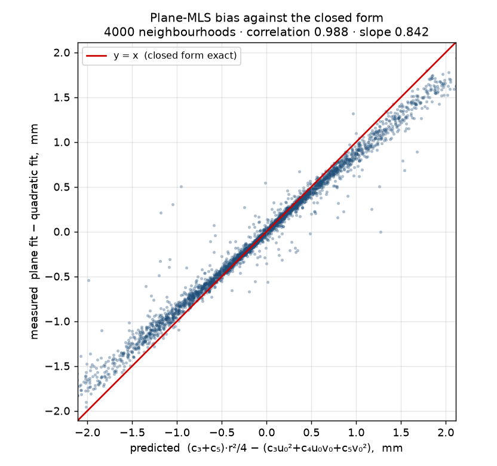

# Moving Least Squares, in full

What Stage 3's last step does, why each part of it is there, and what the
arithmetic is. The implementation is `mls_project` in
[`pipeline/ghost.py`](../../pipeline/ghost.py); every line reference below points at
it.

The companion figure is
[`experiments/mls_how_it_works.png`](../archive/2026-08/experiments/mls_how_it_works.png), which
walks one real 72-point neighbourhood through the same five steps.

---

## 1. The problem

VGGT does not emit one surface. It emits the limb's surface more than once,
because separate camera groups register the scene slightly differently, and the
disagreement is systematic rather than random: on `inputs/small_leg` the two
sheets are **2.7 mm apart** and split cleanly by view — frames 2 and 4 on one
sheet, frames 0, 1, 3 and 5 on the other, with no mixing.

Two steps run before MLS and neither can fix this:

- `ghost_voxel_downsample` collapses about 6.4 points per voxel into one. That
  removes duplicates *within* a voxel, but the two sheets are 2.7 mm apart and
  the voxel is 0.65 of a point spacing, so both survive as separate occupancies.
- `normal_aware_filter` drops points whose normal disagrees with their
  neighbours'. The ghost sheet is not misoriented — it is parallel — so this
  removes only 535 stragglers, 2.9%.

What remains is a **shell with thickness** where a surface belongs. Alpha shapes
and Poisson both interpret thickness as shape: alpha wraps both sheets, Poisson
fits an indicator field that has to decide which sheet is the boundary.

MLS collapses the thickness **without deleting a single point**. That property is
what makes it safe: nothing that was measured is discarded, so no information is
lost, only re-positioned.

---

## 2. Notation

Let the cloud be `P = {p₁ … p_N}`, `pᵢ ∈ ℝ³`. Fix one point `p` — MLS treats each
point independently, and the whole procedure below runs once per point.

| symbol | meaning |
|---|---|
| `s` | mean nearest-neighbour distance over the cloud |
| `r` | neighbourhood radius, `r = radius_mult · s` |
| `N(p)` | the neighbours of `p`, `{q ∈ P : ‖q − p‖ ≤ r}` |
| `c` | the neighbourhood's centroid |
| `(t_u, t_v, n)` | an orthonormal frame, `n` the estimated normal |
| `(u, v, h)` | a neighbour's coordinates in that frame |
| `f(u,v)` | the fitted height field |

---

## 3. Step 1 — the neighbourhood

```python
neighbourhood_radius = point_spacing * radius_mult          # ghost.py:208
neighbourhoods = tree.query_ball_point(points, r=neighbourhood_radius, workers=-1)
```

### The spacing estimate

`point_spacing` is the mean distance from a point to its nearest neighbour,
measured on a **sample of 5000 points** rather than all of them
(`ghost.py:204`). `k=2` in the query because the nearest neighbour of a point in
its own tree is itself, at distance zero; the second result is the real one.

The sample is not laziness. The mean of `s` over 5000 draws has a standard error
of `σ/√5000`, under 1.5% of `σ` — far below the precision `radius_mult` is
specified to — while the k-d tree query is the expensive part of the function.

Measured on the limb cloud: **s = 2.05 mm**, so **r = 8.2 mm** at
`MLS_RADIUS_MULT = 4.0`.

### Why the radius is in spacings, not millimetres

The cloud's density is not a property of the limb; it depends on how close the
camera was, how many frames there were, and what the confidence filter kept. A
radius fixed at, say, 8 mm would be four spacings on one capture and one spacing
on another, and one spacing is not a neighbourhood — it is a point and its
nearest friend, from which no surface can be fitted.

Expressing `r` in spacings makes the neighbourhood contain **a roughly constant
number of points regardless of density**. Measured: median 50 neighbours, 5th
percentile 29, 95th percentile 68.

### The constraint that matters

**`r` must exceed the ghost separation.** If `r < 2.7 mm` here, the two sheets
never appear in the same neighbourhood. Each sheet then fits itself, each point
is projected onto its own sheet, and the operation is close to a no-op — the
shell stays exactly as thick as it was.

This is the one parameter that can fail silently: nothing errors, the point count
is unchanged (it always is), and the output looks like an MLS result. The check is
the shell thickness, which is why the ghost chain reports it at every step.

### The neighbourhood is a ball, not a slab

`query_ball_point` returns a **sphere** — every point within `r` in any
direction, above and below included. It is not a horizontal disc and there is no
slicing anywhere in this function. A per-layer neighbourhood would cut the limb
into rings and throw away the vertical curvature, which is exactly what the
quadratic fit exists to keep.

The only partitioning is **per object**: `_clean_cluster` in
[`pipeline/stages/clean.py`](../../pipeline/stages/clean.py) runs the whole chain
separately for the cube and the limb, so no neighbourhood ever spans two objects
and pulls each toward the other.

---

## 4. Step 2 — the local frame, from the points themselves

```python
neighbourhood_centre = neighbour_points.mean(axis=0)
centred = neighbour_points - neighbourhood_centre
_, _, principal_axes = np.linalg.svd(centred, full_matrices=False)   # ghost.py:227
normal = principal_axes[2]
tangent_u, tangent_v = principal_axes[0], principal_axes[1]
```

### What the SVD is doing

Let `X ∈ ℝ^{k×3}` be the centred neighbours, one point per row. Its singular
value decomposition is

```
X = U Σ Vᵀ,     Σ = diag(σ₁ ≥ σ₂ ≥ σ₃ ≥ 0),   V = [v₁ v₂ v₃] orthonormal
```

The rows of `Vᵀ` — what NumPy returns as `principal_axes` — are the right
singular vectors. They are the eigenvectors of the scatter matrix:

```
XᵀX = V Σ² Vᵀ,     so  (XᵀX) vⱼ = σⱼ² vⱼ
```

and `XᵀX = (k−1) · Cov(neighbours)`. So `v₁, v₂, v₃` are the principal axes of
the neighbourhood, ordered by variance, and `σⱼ²/(k−1)` is the variance along
`vⱼ`.

A patch of surface spreads out in two directions and barely at all in the third.
Therefore **`v₃`, the least-variance direction, is the surface normal**, and
`v₁, v₂` span the tangent plane. No normals are estimated beforehand and none are
read from the file — the neighbourhood's own shape supplies the frame.

Computing the SVD of `X` directly rather than eigendecomposing `XᵀX` is the
numerically better route: forming `XᵀX` squares the condition number, and the
smallest singular value — the one we actually want — is the one that suffers.

### The sign of the normal does not matter

SVD fixes `v₃` only up to sign; NumPy's choice is arbitrary and can differ
between neighbourhoods. This never propagates, because the normal appears twice
and the signs cancel.

Flip `n → −n`. Then every neighbour's height flips, `h → −h`, so the least-squares
solution flips, `c → −c`, so the fitted height flips, `f → −f`. The final
reconstruction

```
target = c + u₀·t_u + v₀·t_v + f(u₀,v₀)·n
```

contains the product `f·n = (−f)(−n) = f·n`, unchanged. The same argument applies
to a sign flip of `t_u` or `t_v`, which flips `u₀` and the odd-order coefficients
together.

This is worth knowing because a pipeline that *did* depend on normal orientation
would need a consistent-orientation pass, and this one deliberately does not.

### How well-determined the frame actually is

The frame is only as meaningful as the gap between `σ₂` and `σ₃`. If `σ₃ ≈ σ₂` the
neighbourhood is not plate-like and "the normal" is not a well-posed question.

Measured on the pre-MLS limb cloud: **median `σ₃/σ₂` = 0.43**, 95th percentile
0.76. That is high, and it is honest to say so — the ratio is inflated by exactly
the thing MLS is there to remove. The shell has real thickness at this stage, and
a neighbourhood of radius 8.2 mm on a limb of radius ~43 mm also contains genuine
curvature. The frame is a working approximation, not a precise tangent plane, and
the quadratic fit is what absorbs the difference.

---

## 5. Step 3 — local coordinates

```python
offset_u = centred @ tangent_u
offset_v = centred @ tangent_v
height   = centred @ normal          # ghost.py:233
```

Because `(t_u, t_v, n)` is orthonormal, the change of basis is three dot
products, with no matrix inverse:

```
u = ⟨q − c, t_u⟩,    v = ⟨q − c, t_v⟩,    h = ⟨q − c, n⟩
```

and the inverse is a sum, `q = c + u·t_u + v·t_v + h·n`.

The point of this step is representational. In world coordinates the surface is
an implicit two-dimensional set in ℝ³. In the local frame it is the graph of a
scalar function `h = f(u,v)` — provided the patch does not fold back on itself
over the tangent plane, which is what "the neighbourhood is small enough to be
plate-like" buys. Fitting a scalar function is a linear least-squares problem;
fitting an implicit surface is not.

Note that `h` is measured **relative to the centroid**, so for a symmetric patch
`c₀ ≈ 0`. The constant term carries the offset between the centroid and the
fitted surface — which, as section 8 shows, is precisely where the ghost gets
resolved.

---

## 6. Step 4 — the least-squares fit

```python
design = np.column_stack([np.ones_like(offset_u), offset_u, offset_v,
                          offset_u * offset_u,
                          offset_u * offset_v,
                          offset_v * offset_v])            # ghost.py:240
coefficients, *_ = np.linalg.lstsq(design, height, rcond=None)
```

### The model

```
f(u,v) = c₀ + c₁u + c₂v + c₃u² + c₄uv + c₅v²
```

A bivariate quadratic, six coefficients. In matrix form, with one row per
neighbour:

```
        ⎡1  u₁  v₁  u₁²  u₁v₁  v₁²⎤        ⎡c₀⎤       ⎡h₁⎤
   A =  ⎢1  u₂  v₂  u₂²  u₂v₂  v₂²⎥ ,  c = ⎢⋮ ⎥ ,  h = ⎢⋮ ⎥
        ⎣⋮                        ⎦        ⎣c₅⎦       ⎣h_k⎦
```

and we solve

```
   ĉ = argmin ‖A c − h‖²
```

The normal equations `AᵀA ĉ = Aᵀh` give the answer in closed form when `A` has
full column rank, but `lstsq` does not use them — it goes through an SVD of `A`,
which is slower and considerably better conditioned. With `rcond=None`, singular
values below `max(k,6)·eps·σ₁` are treated as zero, so a rank-deficient
neighbourhood yields the minimum-norm solution instead of a division by
something near zero.

### Rank and the point count

Six coefficients need at least six independent rows, hence the guard

```python
if polynomial and len(neighbour_indices) >= 6:
```

with the plane branch as the alternative. In the shipped configuration this guard
never fires, because `min_neighbors = 8` has already skipped any point with fewer
than eight neighbours (`ghost.py:217`). It matters only if a caller lowers
`min_neighbors` below 6.

Rank can also fail with enough points: six collinear neighbours span a
one-dimensional set of `(u,v)` and cannot determine a two-dimensional quadratic.
`lstsq` handles that through the `rcond` cutoff rather than raising, and the
`LinAlgError` branch below it catches the convergence failures that do raise,
leaving the point untouched and incrementing `skipped`.

### Conditioning

The design matrix mixes columns of very different magnitude: `1`, then `u ~ 8·10⁻³`
(metres), then `u² ~ 6·10⁻⁵`. That is a genuine concern, so it was measured
rather than assumed.

**Median `cond(A) = 8.3 × 10⁴`**, 95th percentile `1.0 × 10⁵`, worst observed
`5.6 × 10⁵`.

In double precision (`eps ≈ 2.2 × 10⁻¹⁶`) a condition number of `10⁵` costs about
five digits, leaving eleven. The fit is not close to trouble. It would be if the
cloud were in kilometres, and it would be worth rescaling `u, v` by `r` if this
were ever ported to float32.

### No weights

Classical MLS weights each neighbour by a decreasing function of distance,
typically `w(d) = exp(−d²/σ²)`. **This implementation does not.** Every neighbour
inside `r` counts equally and every point outside counts not at all — a hard
cutoff.

The consequence is that the fitted surface is **discontinuous in the data**: move
a point infinitesimally across the radius boundary and the fit jumps. A smooth
weight makes the fitted surface a continuous function of the cloud, which is what
makes the classical construction well-defined as a *surface* rather than as a
per-point recipe.

For collapsing a two-sheet shell this does not matter much — the effect being
corrected is far larger than the discontinuity — but the difference is real and
section 10 lists it.

---

## 7. Step 5 — the projection

```python
this_u = float((points[point_index] - neighbourhood_centre) @ tangent_u)
this_v = float((points[point_index] - neighbourhood_centre) @ tangent_v)
fitted_height = (coefficients[0]
                 + coefficients[1] * this_u + coefficients[2] * this_v
                 + coefficients[3] * this_u * this_u
                 + coefficients[4] * this_u * this_v
                 + coefficients[5] * this_v * this_v)
target = (neighbourhood_centre
          + this_u * tangent_u + this_v * tangent_v
          + fitted_height * normal)                          # ghost.py:267
```

The point is evaluated at **its own** `(u₀, v₀)`, not at the neighbourhood
centre. Its tangential position is preserved exactly; only its height changes.

This distinction is the difference between smoothing and shrinking. Moving each
point to the centroid of its neighbours — Laplacian smoothing — displaces points
tangentially as well, which on a closed convex shape drags the whole surface
inward and loses volume with every iteration. Projecting along the normal alone
leaves the tangential distribution untouched.

It also means MLS is **not idempotent in the usual way but is close to it**: a
second pass re-fits from already-projected points, which sit closer to their own
fitted surfaces, so the second pass moves them very little. The pipeline runs
exactly one pass.

---

## 8. Why the ghost collapses

Model the shell as two parallel sheets, separated by `δ` along the normal, with
`k₁` and `k₂` points in the neighbourhood. Take the surface locally flat, so the
model reduces to the constant term.

Least squares on a constant is the mean:

```
   ĉ₀ = (1/k) Σ hᵢ = (k₁·(+δ/2) + k₂·(−δ/2)) / (k₁ + k₂)
      = (δ/2) · (k₁ − k₂)/(k₁ + k₂)
```

With balanced sheets, `k₁ = k₂`, the fit lands **exactly halfway between them**
and every point in the neighbourhood is projected to that plane. The shell
thickness goes to zero, and the surface ends up at the average of the two
registrations — which, given that neither is more trustworthy than the other, is
the right place for it.

With unbalanced sheets the fit is pulled toward the denser one, in proportion to
the imbalance. That is why the measured result is a large reduction rather than
total collapse: **1.58 mm → 0.66 mm RMS**, with the point count unchanged.

The quantity being reported is a spread, not an extremum — the RMS radial
residual about the median radius in each 5° bin. This matters because it also
explains a counter-intuitive number in the ghost chain: shell thickness *rises*
slightly through the voxel step (1.63 → 1.75 mm) because thinning leaves fewer
points per bin, not because the surface got worse. MLS is the step that actually
collapses it.

---

## 9. Why quadratic and not planar

`polynomial=False` drops `c₃, c₄, c₅` and fits a flat patch. It collapses the
shell just as well — the argument in section 8 only used the constant term. What
it does not do is preserve shape.

### The bias, derived

Take the surface curved with principal curvatures `κ₁, κ₂` in the tangent
directions. To second order, its height over the tangent plane at the centroid is

```
   h(u,v) ≈ ½κ₁u² + ½κ₂v²
```

so the true quadratic coefficients are `c₃ = κ₁/2`, `c₅ = κ₂/2`, `c₄ = 0`.

A plane fit to a symmetric neighbourhood returns the **mean height**, since the
odd terms average to zero:

```
   ĉ₀^plane = E[h] = ½κ₁·E[u²] + ½κ₂·E[v²]
```

If the neighbourhood projects to a uniform disc of radius `r`, then by symmetry
`E[u²] = E[v²] = r²/4`, giving

```
   ĉ₀^plane = (κ₁ + κ₂) · r²/8 = H · r²/4
```

with `H` the mean curvature. The quadratic fit, evaluated at the same point,
returns `c₀` — no such offset. So the plane sits a distance

```
   Δ = H · r²/4
```

off the surface, on the concave side. For a cylinder (`κ₂ = 0`, `κ₁ = 1/R`) that
is the memorable form

```
   Δ = r² / (8R)
```

Every point is displaced by roughly `Δ` in the same direction — **inward, for a
convex limb** — so the effect does not average out. It is a systematic shrink of
the reconstructed cross-section, and it propagates directly into the reported
volume.

### The derivation, checked against the code

Prediction and measurement, per point, on 4000 sampled neighbourhoods of the
pre-MLS limb cloud: run both fits, evaluate both at the point's own `(u₀, v₀)`,
and compare the difference against the closed form
`(c₃+c₅)·r²/4 − (c₃u₀² + c₄u₀v₀ + c₅v₀²)` using the coefficients the quadratic
fit actually produced.



| | |
|---|---|
| correlation | **0.988** |
| slope | 0.842 |
| measured, median | −0.0101 mm |
| predicted, median | −0.0109 mm |
| median \|1/H\| from the fits | 42.9 mm |

The closed form predicts the pointwise difference well. The slope of 0.84 rather
than 1.00 is the uniform-disc assumption: a neighbourhood on a curved surface does
not project to a *uniformly* filled disc, and neighbourhoods near a boundary are
not symmetric at all, both of which bias `E[u²]` below `r²/4`.

**What this does not establish.** The aggregate figure quoted elsewhere — plane
MLS losing **1.36%** of cross-section area against the quadratic's 0.05%, from
`E-outline-statistic` — is a different measurement, taken on the pipeline's own
scales at the standard slice. The check above is pointwise and re-derives the
cloud from `leg_cluster.ply`, which gives a finer spacing than the pipeline's
scene-wide estimate and therefore a smaller `r`. The two are consistent in sign
and mechanism; they are not the same number, and it would be wrong to present
them as a single result.

What is established independently is the aggregate direction: over 40 slices the
plane-versus-quadratic area gap has median **+1.10 pp** and is positive in
**100%** of them. A one-sided effect, not noise.

### The cube is the exception

`MLS_BOX_POLYNOMIAL` lets the reference cube use the plane fit, because a cube
face genuinely is planar: `κ₁ = κ₂ = 0` makes `Δ = 0` and the bias vanishes.
Fitting a quadratic to a flat face is not wrong, only unnecessary — it spends six
degrees of freedom describing something three would cover, and the extra freedom
fits noise.

---

## 10. What this implementation is not

The name covers a family, and it is worth being precise about which member this
is.

**Levin's projection MLS**, the construction usually meant by the term, defines a
surface implicitly: for a query point it finds a local reference plane by solving
a non-linear problem (the plane whose weighted sum of squared distances is
stationary), fits a weighted polynomial over it, projects, and **iterates to a
fixed point**. The resulting surface is `C^∞` where the weight function is, and
is independent of which point you started from.

This implementation is a single pass of a simplified version:

| | classical | here |
|---|---|---|
| weights | smooth, e.g. Gaussian | none — hard cutoff at `r` |
| reference plane | solved for, non-linearly | PCA of the neighbourhood |
| iteration | to a fixed point | one pass |
| output | a well-defined surface | a repositioned point set |

The consequences are real and worth naming: the fit is discontinuous across the
radius boundary; the result depends on the input sampling in a way the classical
surface does not; and no point is guaranteed to lie exactly on any single
consistent surface.

For the job at hand — collapse a 2.7 mm registration disagreement into one sheet
without deleting evidence — the simplification is defensible, and it is
considerably cheaper. It should not be described as "the MLS surface".

---

## 11. Cost

Per point: one radius query, one 3×3 SVD (via a `k×3` SVD), and one `k×6`
least-squares solve. With `k` the neighbourhood size,

```
   O(N · (log N + k + k·6²))  ≈  O(N·k)
```

The Python loop over points is the bottleneck, not the linear algebra — each
neighbourhood is a handful of microseconds of BLAS wrapped in interpreter
overhead. On 17,444 limb points it costs a few seconds, which is why the loop has
never been worth vectorising.

The two k-d tree calls (`query` for spacing, `query_ball_point` for
neighbourhoods) both pass `workers=-1` and are threaded.

---

## 12. Parameters, and how each one fails

| parameter | shipped | what happens if it is wrong |
|---|---|---|
| `radius_mult` | `MLS_RADIUS_MULT = 4.0` | too small: below the ghost separation, the sheets never share a neighbourhood and MLS is a near no-op — silently. Too large: the neighbourhood spans real curvature the quadratic cannot represent, and detail is flattened |
| `min_neighbors` | 8 | too low: rank-deficient fits. Too high: sparse regions are skipped and keep their ghost |
| `polynomial` | `True` for the limb, `MLS_BOX_POLYNOMIAL` for the cube | `False` on a curved object shrinks it by `H·r²/4` at every point, systematically inward |

Both failure modes of `radius_mult` are invisible in the point count, which never
changes. The observable is shell thickness, reported at every step of the ghost
chain for exactly this reason.

---

## 13. What the function returns

`(points_projected, colors, stats)`. Colours are carried through untouched —
MLS moves points, so the colour attached to each point is still that point's.

`stats` carries `spacing`, `radius`, `median_move`, `p95_move` and `skipped`, and
has **one shape on every return path**. The early return for a too-small cloud
used to hand back `{"moved_mm": 0.0}` while the normal path returned five
different keys, so any caller reading the normal keys raised `KeyError` on a cloud
too small to project. `_stats` exists to make that impossible.

---

## Related

- [`experiments/mls_how_it_works.png`](../archive/2026-08/experiments/mls_how_it_works.png) — the
  five steps on one real neighbourhood
- [`experiments/mls_ghost_limb_section.png`](../archive/2026-08/experiments/mls_ghost_limb_section.png)
  — plane against quadratic on a cross-section
- [`experiments/ghost_removal_chain.png`](../archive/2026-08/experiments/ghost_removal_chain.png) —
  the same slice after every function in the chain
- `E-outline-statistic` in [`../archive/2026-08/experiments.md`](../archive/2026-08/experiments.md) — how the
  outline is measured, and the statistic that got it wrong once
- [`experiments/mls_plane_vs_quadratic.md`](../archive/2026-08/experiments/mls_plane_vs_quadratic.md)
