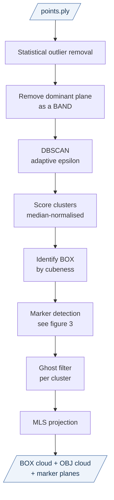
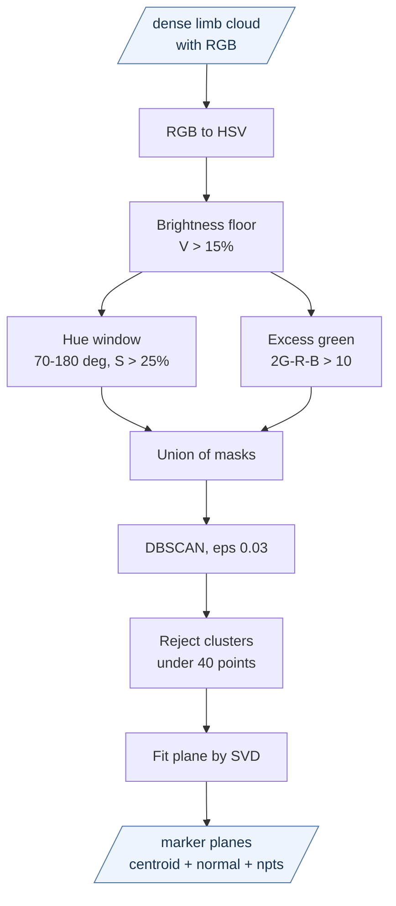
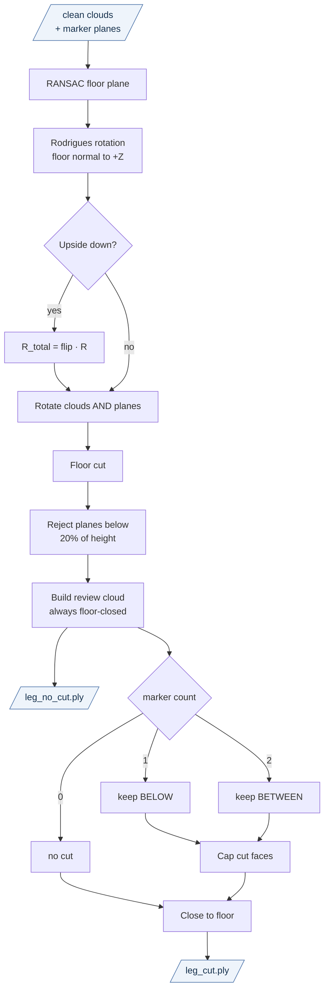
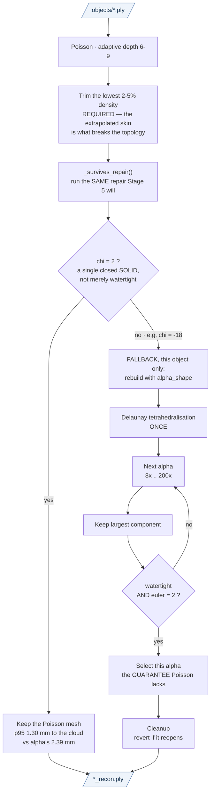
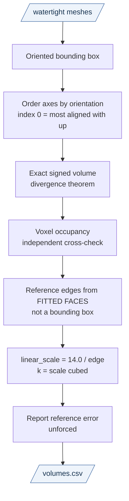
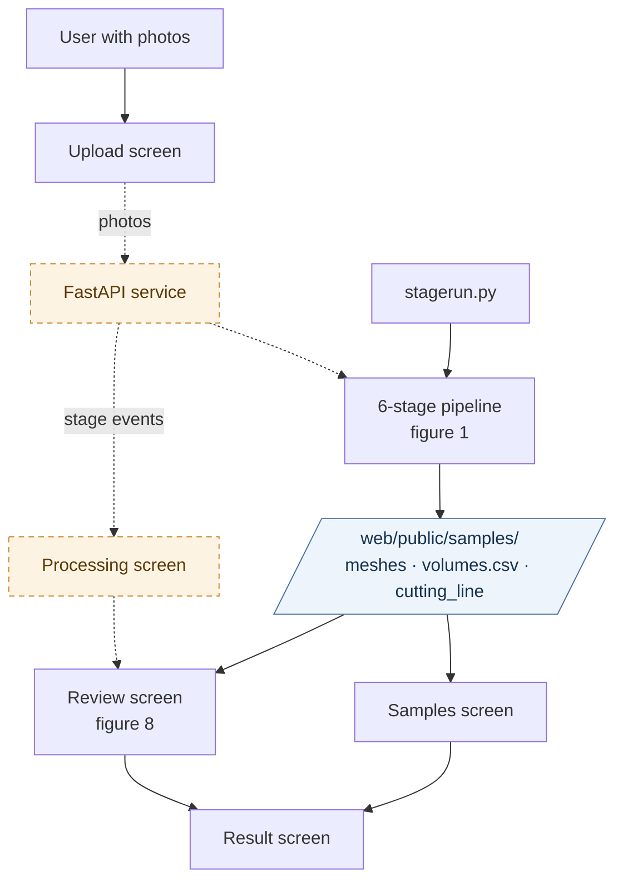
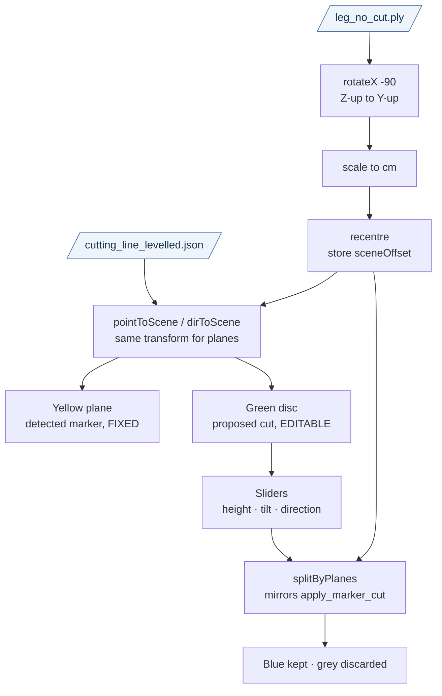

# Pipeline Flowcharts

Eight figures, smallest scope first. Each is self-contained and readable on its
own — the detail lives in the tables beneath each one rather than inside the
node labels.

| # | figure | scope |
|---|---|---|
| 1 | [Pipeline spine](#figure-1--pipeline-spine) | 6 stages, files between them |
| 2 | [Stage 3 · Phase A](#figure-2--stage-3-phase-a--clustering) | clustering |
| 3 | [Marker detection](#figure-3--marker-detection) | colour rule and plane fit |
| 4 | [Stage 3 · Phase B+C](#figure-4--stage-3-phase-b--c--level-cut-close) | levelling, cut, close |
| 5 | [Stage 4](#figure-5--stage-4-poisson-with-α-selection-as-the-fallback) | Poisson, α fallback |
| 6 | [Stage 6](#figure-6--stage-6-volume-and-scale) | volume and scale |
| 7 | [Full system](#figure-7--full-system-with-website) | pipeline + website |
| 8 | [Review screen](#figure-8--review-screen-coordinate-flow) | coordinate handling |

Then a [per-stage I/O reference](#per-stage-io-reference).

> For **one** chart containing every stage and every sub-process with its
> inputs and outputs, see [`full_flowchart.md`](full_flowchart.md). This file
> is for reading a stage at a time; that one is for seeing where anything sits
> in the whole.

Everything runs **locally** — VGGT on one GPU, the web app on `localhost:3111`,
the compute service on `localhost:8000`. Nothing is sent to a cloud service.

Conventions: blue = a file on disk · amber dashed = **not built yet**.

> ### Since these figures were drawn
>
> Three structural changes are reflected in Figure 1 and the per-stage reference
> below, but **not yet redrawn in Figures 2-8**, which still show the older shape:
>
> 1. **Stage 0 exists.** A framing gate runs before Stage 1 and can refuse a
>    capture outright. `pipeline/stages/prep.py`. Its output is now chained into
>    Stage 1 automatically — `stagerun.py 0-6` used to write the crops and then
>    hand VGGT the raw photographs anyway, discarding the whole stage silently.
> 2. **The cut is deferred.** Stage 3 runs twice per measurement — once to detect
>    the plane (`--no-cut`), then once to apply the plane a person confirmed
>    (`--cut-only`). Figure 4 shows detection and cutting as one pass. Stages 4-6
>    also run before the confirmation, but **only on the reference cube**, to
>    produce the scale the Review screen draws in; Figure 1 now shows that branch,
>    and `service/jobs.py:_postcondition` fails the job if that pass ever measures
>    the subject.
> 3. **Stage 6 is reverted to main's version**, pending review by its author. The
>    scale derivation in Figure 6 describes the *parked* method, not what runs.
>    See `docs/archive/2026-08/stage06_experiments.md`.
> 4. **Stage 4 defaults to Poisson**, not alpha shape, with alpha as an automatic
>    per-object fallback whenever Poisson's mesh does not repair to χ = 2.
>    Changed 2026-08-23 after Stage 5 was fixed to call `pymeshfix.repair()`
>    rather than `fill_holes()` alone — see `../archive/2026-08/experiments.md`, E-psr-adopted.
> 5. **The reference cube is 10 cm** on captures from August 2026 onward.
>    `REFERENCE_REAL_SIZE_CM` defaults to 10.0 and is env-overridable; the
>    fixtures in these figures (`small_leg`, `est_325`) need 14.
> 6. **Stage 6 is resolved, not open.** Figure 6 below describes the *parked*
>    derivation and recommends it. Measured against five water-displacement
>    volumes it is the less accurate of the two — 4.1% against the shipping
>    method's 1.7% — so `main`'s version stays. See `stage06_experiments.md`.
> 7. **Stage 3 gates its candidate planes** before selecting among them: at
>    least one cube height above the floor, within 35° of perpendicular to the
>    limb's local axis, and the learned band colour refused outright when it
>    cannot separate band from limb. Figure 3 predates all of it.
> 8. **Stage 6 checks the reconstruction.** The reference cube fills 0.87–0.89
>    of its own oriented box on a sound capture; a warning fires below 0.83.

---

## Figure 1 — pipeline spine

```mermaid
flowchart LR
    IN[/"photos<br/>6-12 frames"/]:::file
    S0["STAGE 0<br/>framing gate"]
    G{"every frame<br/>usable?"}
    RETAKE[/"re-take<br/>the named photos"/]:::file
    F0[/"frame_NN.png 518²<br/>framing.json"/]:::file
    S1["STAGE 1<br/>VGGT inference"]
    F1[/"predictions.npz"/]:::file
    S2["STAGE 2<br/>point cloud"]
    F2[/"points.ply<br/>~859k pts"/]:::file
    S3["STAGE 3 --no-cut<br/>segment · detect plane"]
    F3[/"leg_open · leg_no_cut<br/>box · cutting_line"/]:::file
    CAL["STAGES 4-6<br/>reference cube ONLY"]:::cal
    FCAL[/"volumes.csv<br/>reference row only"/]:::file
    CONFIRM{"cut<br/>confirmed?"}
    S3B["STAGE 3 --cut-only<br/>apply the chosen plane"]
    S4["STAGE 4<br/>Poisson, alpha shape as fallback"]
    F4[/"*_recon.ply"/]:::file
    S5["STAGE 5<br/>watertight"]
    F5[/"*.ply + *.stl"/]:::file
    S6["STAGE 6<br/>volume"]
    F6[/"volumes.csv"/]:::file
    DONE[/"measured volume"/]:::file

    IN --> S0 --> G
    G -- no --> RETAKE
    G -- yes --> F0 --> S1 --> F1 --> S2 --> F2 --> S3 --> F3 --> CONFIRM
    S3 -. "calibration only" .-> CAL --> FCAL -. "cm per unit<br/>for the review" .-> CONFIRM
    CONFIRM -- "adjust plane" --> S3B --> CONFIRM
    CONFIRM -- yes --> S4 --> F4 --> S5 --> F5 --> S6 --> F6 --> DONE

    classDef file fill:#eef4fb,stroke:#4a72a8,color:#16324f
    classDef cal fill:#fbf3e6,stroke:#a8752a,color:#573a10
```



**The subject is never measured before the cut is confirmed.** That is the one
property this shape exists to guarantee, and it is enforced rather than assumed:
`service/jobs.py:_postcondition` fails the job if a `--no-cut` pass leaves a
`leg_cut.ply` on disk or a non-reference row in `volumes.csv`.

Stage 3 appears twice on purpose. The first pass runs with `--no-cut`: it detects
the cutting plane, publishes it, and deliberately writes no `leg_cut.ply`.

The amber branch is the part that is easy to misread. Stages 4-6 do run before the
confirmation — but **only on the reference cube**, and only to produce the
`linear_scale` in centimetres per mesh unit that the Review screen needs to draw
the cutting plane in real units. Nothing about the subject is reconstructed,
measured or displayed on that pass.

Deriving that scale without the detour was measured and rejected: an oriented
bounding box on Stage 3's own segmented cube cloud gives **40.6 cm/unit against
Stage 6's 60.86 — 33% out**, because that cloud carries the wall points added when
the base is extended to the floor. The cube has to pass through reconstruction for
its size to be known. See `docs/archive/2026-08/experiments.md`, E-preconfirm-scale.

| stage | time | in | out |
|---|---|---|---|
| 0 framing | ~25 s | image folder | `frame_NN.png` (518²), `framing.json` |
| 1 inference | ~19 s | Stage 0 frames | `predictions.npz` |
| 2 point cloud | ~1 s | `predictions.npz` | `points.ply` |
| 3 clean `--no-cut` | ~8 s | `points.ply` | 4 PLY + 2 JSON, **no `leg_cut.ply`** |
| 4-6 calibration | ~14 s | `objects/box.ply` | `volumes.csv`, reference row only |
| *review* | — | `leg_no_cut.ply` + `cutting_line.json` | the confirmed planes |
| 3 `--cut-only` | ~1 s | `leg_open.ply` + confirmed planes | `leg_cut.ply` |
| 4 reconstruct | ~12 s | `objects/*.ply` | `*_recon.ply` |
| 5 watertight | ~0.1 s | `*_recon.ply` | `*.ply` + `.stl` |
| 6 volume | ~0.1 s | watertight meshes | `volumes.csv` |

Cold run end to end on `inputs/small_leg`: **80 s** (re-measured 2026-08-22,
after Stage 0's output stopped being discarded). The re-cut after a review costs
about 10 s, because Stage 1 is not repeated.

---

## Figure 2 — Stage 3 Phase A · clustering

Runs in **original VGGT space, before levelling**. `main` levelled first, which
made clustering depend on a RANSAC fit that could fail.



| step | what it does | the detail that matters |
|---|---|---|
| A2 **band removal** | drop `\|n·p + d\| ≤ 2·τ` | **not** just the RANSAC inliers. VGGT ghosts the floor, so it is a sandwich ~2 thresholds thick; removing the middle leaves both skins — 41,749 points of floor slab that DBSCAN then welds to the limb |
| A3 DBSCAN | ε from mean NN distance | objects rest on the floor, so without A2 every object links through the ground |
| A4 scoring | `0.4·N/med(N) + 0.3·ρ/med(ρ) + 0.3·(1 − D/max D)` | scale-free. `main` used magic constants that encoded an assumed scale |
| A5 box ID | cubeness = `min extent / max extent` | plus an ArUco-likeness score |
| A7 ghost filter | voxel dedup, then reject `δ = 1 − \|n·n̄\| > 0.3` | **per cluster** — box and limb have different densities and must not share a voxel size |
| A8 MLS | project onto a local degree-2 height field | collapses both ghost sheets onto one surface. Radius must exceed ghost separation |

---

## Figure 3 — marker detection

The marker band defines where the measurement stops. Two sources find it: the colour rule below, and `core/bands3d.py`, which projects Stage 0's band boxes through Stage 1's pointmap and supplies any plane the colour rule missed (additive — a colour plane is never moved or dropped).



**Why the brightness floor is first.** Hue is a ratio to the channel maximum, so
as `V → 0` it becomes numerically arbitrary. `main` had no floor and an
upper-open window (`h > 60`, accepting 83% of the hue wheel), which classified
this as markers:

| what | RGB | ExG | hue | V | old rule |
|---|---|---|---|---|---|
| shadow | (8, 6, 8) | −4 | 300° | **3.1%** | passes |
| skin | (139, 87, 89) | −54 | **358°** | 54.5% | passes |
| **the band** | (60, 52, 30) | **+14** | 44° | 23.5% | passes via ExG |

The shadow cluster reached 3,349 points against 197 for the real band and won
the cut.

**M4 is what actually finds the marker, not M3.** The band is khaki, hue 44° —
it fails every green hue test. Excess green separates it from skin (+14 vs −54).
Raising the ExG threshold to 15 silently lost the only real marker in the
dataset.

A height gate (reject below 20% of object height) also applies, but **not here** —
it runs in Phase C, because detection happens before levelling and "height" has
no meaning yet. See figure 4.

---

## Figure 4 — Stage 3 Phase B + C · level, cut, close



> **Note on the diagram:** for 2 markers, `C9` is a pass-through — the bottom is
> already the lower cut face, so nothing is added. See the table.

**`R_total` — a bug fixed.** An upside-down scene triggers a 180° flip *after*
the first rotation. `main` applied the flip to the cloud but kept the original
`R` for the marker planes, so the cut plane landed in the wrong frame and cut
99 mm off the wrong end.

**Why C2 lives here and not in detection.** Detection runs in original VGGT
space, where the vertical axis is whatever the camera gave — on `small_leg` the
limb's long axis is **Y**, not Z. A Z-based height test there measures sideways.
Only after `R_total` does "height" mean height.

**The cut rule.** Each normal is first flipped to point along world up, so the
detected normal's sign cannot change the outcome. Then:

| markers | keep | bottom of the kept region | who closes it |
|---|---|---|---|
| 0 | everything | the floor | floor extend + bottom cap |
| 1 | `d ≤ 0` (below) | the floor | floor extend + bottom cap |
| 2 | `(d₁ ≤ 0) XOR (d₂ ≤ 0)` | the **lower cut face** | `cap_points_on_plane` |

The XOR needs no ordering of the planes: a point between them is below the upper
and above the lower, so exactly one test is true.

`main` used a **centroid-side** rule instead — keep the side the cloud's centroid
is on. That inverts the whole selection when a plane is dragged past the
centroid, and only means "keep between" when the centroid already sits between
the two planes.

`main` also **filled before cutting**, which fabricated a floor skirt inside
2-marker segments. `leg_no_cut.ply` is built from its own copy so it stays
floor-closed for review, while the cut runs on the unfilled cloud.

---

## Figure 5 — Stage 4: Poisson, with α selection as the fallback



**Why Euler and not watertightness.** A surface riddled with tunnels is still
closed, and the signed-volume integral faithfully subtracts those tunnels — the
mesh looks like a perfect cube from outside while reporting far too little
volume. `χ = V − E + F`, and `χ = 2 − 2g` for genus `g`, so each tunnel costs 2.
Measured on the reference cube:

| α | watertight | χ | volume |
|---|---|---|---|
| 30× | yes | **−1** | 1898 cm³ |
| 40× | yes | **2** | 2467 cm³ |

Selecting on watertightness alone would have under-read by 31%.

**R4 before R5.** Stray fragments each contribute their own `χ = 2`, so debris
can push a good mesh to `χ = 6` and get it rejected.

**R2 once.** Alpha shape is computed *from* a Delaunay tetrahedralisation, and
3-D Delaunay on surface-sampled points is pathological — a 42× slowdown was
measured. Building it once and reusing it across all 12 α is 4.3× faster.

**R7 reverts itself.** Cleanup calls `remove_non_manifold_edges()`, which can
tear a closed surface open — undoing the very property α was selected for. It
snapshots first and restores if that happens.

---

## Figure 6 — Stage 6 volume and scale



**The one thing to understand about this pipeline:** scale comes from a measured
**length**, not a volume ratio — and that length is measured from the cube's own
fitted faces, not from a bounding box. An OBB has to guess the orientation, and
on this reference it guessed 1.3 degrees wrong, inflating every edge by 2.2%.

```
ref edge     = mean of the cube's two HORIZONTAL FITTED-FACE edges
linear_scale = 14.0 cm / ref edge
k            = linear_scale ** 3
V_real       = V_mesh * k
```

`main` used `k = V_real / V_mesh`, `ℓ = k^(1/3)`. That treats `V_mesh^(1/3)` as
the edge length, which only holds for a perfect cube, and the cube root
compounds any deviation three times — at 2.2% off cubic it under-read the edge
by 3.1% and inflated every volume ~10%. It also **forces the reference's own
error to zero**, so the system could never report its own accuracy.

The vertical edge is excluded because the cube's underside rests on the floor
and never reconstructs.

**V1/V2.** An AABB around a tilted object reports its *diagonal* — the can
measured 6.09 cm wide by AABB against 5.75 cm by OBB. Axes are ordered by
orientation (`argmax |R[:,i] · ẑ|`), not magnitude, so index 0 is reliably the
axis the floor truncates.

**V4.** Voxel occupancy over-reads by a few percent (boundary voxels counted
whole) and converges downward onto exact. Expect **+1% to +8%**; a result *below*
exact means a self-intersecting or inverted surface.

Current run:

```
horizontal edges  0.2264, 0.2325 units — disagree by 2.68%
linear_scale      14.0 / 0.229427 = 61.02 cm/unit
reference reads   2694 cm3 vs 2744 nominal  ->  -1.8%   (leg scene)
                  2644 cm3 vs 2744 nominal  ->  -3.7%   (can scene)
```

That -1.8% / -3.7% is the honest error bar on every other number — and it is now
smaller than the cube's own build tolerance, since a 2 mm error on a handmade
cardboard cube is 4.3% in volume.

---

## Figure 7 — full system with website

The pipeline is unchanged. **The amber dashed path is not built** — the browser
cannot currently trigger a run.



Today the Upload screen probes `NEXT_PUBLIC_API_URL`, finds nothing, disables
**Start processing** and says *"The compute service is not reachable right now."*
Fixtures are produced by `stagerun.py` and copied into `web/public/samples/` by
hand.

The missing piece is small: accept a photo folder, shell out to
`stagerun.py 1-6`, stream stage progress, serve the result directory. The
front end already has the Processing screen built.

---

## Figure 8 — Review screen coordinate flow

The subtle part of the web layer. The pipeline is **Z-up**; three.js is
**Y-up**; the loader also recentres the cloud. Anything positioned in the same
space — the cut planes especially — must receive the identical transform.



**Why `cutting_line_levelled.json` and not `cutting_line.json`.** The two do not
share a frame — `cutting_line.json` is written pre-levelling, `leg_no_cut.ply`
post-levelling. Drawing them together needs the levelled file.

**Slider angles fold to the upper hemisphere first.** A plane is unchanged by
negating its *whole* normal, but **not** by flipping `z` alone. Reading tilt as
`arccos|n_z|` while keeping the original `x, y` did exactly that, and the plane
visibly reversed the moment any slider moved. Round trip now gives
`|n · n₀| = 1.0000` against 0.7963 before.

**`splitByPlanes` mirrors `apply_marker_cut` exactly**, so the browser preview
and the pipeline agree on which side is kept.

> **Caveat.** The kept/discarded *counts* are not comparable. The browser cuts
> `leg_no_cut.ply` (floor-closed); the pipeline cuts the raw cloud and closes
> afterwards. Both are correct for what they do.

---

## Per-stage I/O reference

### Stage 0 — framing · `pipeline/stages/prep.py`

**In:** `inputs/<name>/*.jpg|png|heic`, 6–12 frames.
**Out:** `00_prep/images/frame_NN.png` (518²), `00_prep/framing.json`,
`00_prep/manifest.json`, annotated overlays in `00_prep/for_debug/`.

| sub-process | how |
|---|---|
| cube bounds | ArUco `DICT_5X5_250` face quads, recovered to full faces by homography, unioned with a GroundingDINO box |
| limb + bands | GroundingDINO boxes, SAM masks; every band box on the selected limb, up to two — `framing.json` reports the count as `bands` |
| band colour | per-column max-deviation trace, **dilated ±3 rows** so it reports the cord's body, not its darkest pixel |
| window | full frame width, sliding vertically; must hold cube + every band with 5% padding |
| gate | accept if our window fits everything, **or** if VGGT's own centre crop would keep what is visible; reject only when neither holds |

The learned band colour is handed to Stage 3 in place of the config's fixed
thresholds, which is what lets a marker of any colour work. `mode` in
`framing.json` records *how* each frame passed — `crop`, `crop-clipped`, or
`…->uncropped` for one that only survived VGGT's own crop.

Failures carry a reason and a severity (`_reject_reasons()`):

| condition | verdict | what the frame is told |
|---|---|---|
| everything found and framed | **pass** | — |
| band missing | **warning** | marker missing — the cut must be placed by hand |
| band found but clipped | **warning** | marker out of window — the suggested cut may be off |
| cube found but clipped | **warning** | cube out of window — VGGT will centre-crop instead |
| cube not detected | **reject** | cube missing — the scale cannot be recovered |
| nothing detected | **reject** | nothing detected — no cube and no marker |
| file cannot be decoded | **reject** | file unreadable — cannot be decoded |

**A warning is a usable frame.** The distinction is what a defect *costs*. The
reference cube sets the scale of every number, so if it is not detected at all
there is nothing to recover from — that is a reject. Everything else degrades the
result without making it impossible: a clipped cube falls back to VGGT's own
centre crop, and a missing band only means the cut is placed by a person in the
review step, which it is anyway. Only rejects stop the run.

Only a reject stops the run; `--continue-on-rejected` overrides even that.

An unreadable file used to be skipped in silence — it vanished from the report,
`submitted` under-counted the photos actually given, and the frame numbering
gained a gap, for the one photo that most needed re-taking. It is now recorded
like any other failure, with `overlay: null` since there is nothing to annotate.

**Anything not croppable is written out raw**, rejected frames included — the window
that could not hold the cube and the band would cut one of them, so VGGT does its
own preprocessing instead. `--continue-on-rejected` decides whether a **rejected**
frame stops the run, not whether the frames are written.

---

### Stage 1 — inference · `pipeline/stages/inference.py`

**In:** Stage 0's `00_prep/images/`, 6–12 frames orbiting the subject, cube
visible in every shot. Within a `stagerun.py` range this is chained
automatically; running stage 1 on its own against a different folder prints a
warning, because doing so silently discards the framing.
**Out:** `01_inference/predictions.npz`.

| sub-process | in | out | notes |
|---|---|---|---|
| frame load | image folder | frame list | capped by `--max_frames` |
| preprocess | frames | `(S,3,518,518)` | `crop` discards ~44% of a 9:16 photo; `pad` keeps it |
| checkpoint | HF hub | state dict | prefers the commercial repo (gated, needs `HF_TOKEN`); fallback is loud |
| forward pass | tensor | pointmap, depth, conf, camera | DINOv2 ViT-L/14, alternating frame/global attention |

`predictions.npz`: `world_points (S,H,W,3)`, `world_points_conf (S,H,W)`,
`depth`, `depth_conf`, `images`, `extrinsic`, `intrinsic`.

---

### Stage 2 — point cloud · `pipeline/stages/pointcloud.py`

**In:** `predictions.npz` · **Out:** `02_pointcloud/points.ply`

| sub-process | maths | why |
|---|---|---|
| adaptive threshold | `τ = percentile(conf, p)`, `p` = `--conf_thres` (45) | VGGT's confidence scale shifts with texture and lighting |
| mask | `conf ≥ τ AND conf > 1e-5` | second term drops exact-zero padding |
| colour attach | reshape `images` → `(S,H,W,3)` | handles both channel orders |
| multi-view consistency | reproject, require `min_views` agreements | **disabled** — removed 41% of points with zero change in shell thickness, because the ghost is the same error in every view |

---

### Stage 3 — clean · `pipeline/stages/clean.py`

**In:** `points.ply` · **Out:** 4 PLY + 2 JSON

| file | what |
|---|---|
| `objects/leg_cut.ply` | the measured cloud, cut and closed |
| `objects/leg_no_cut.ply` | complete uncut cloud — the review artifact |
| `objects/box.ply` | reference cube |
| `objects/merged.ply` | both, for inspection |
| `debug/cutting_line.json` | marker planes, **original VGGT space** |
| `debug/cutting_line_levelled.json` | after `R_total`. `markers` = the planes this run cut on, `candidates` = every plane that passed the gates, `cut_mode` = which rule selected the first from the second. The web review seeds from `candidates` |

Phases: A → figure 2, marker sub-flow → figure 3, B and C → figure 4.

---

### Stage 4 — reconstruction · `pipeline/workers/recons_methods_worker.py`

**In:** `03_clean/objects/*.ply` · **Out:** `04_recon/mesh/*_recon.ply`

Methods: **`poisson` (default)**, `alpha_shape`, `poisson_omp1`,
`box_primitive`. `ball_pivot` was removed — it never produced a usable mesh.

**Poisson first, alpha as an automatic per-object fallback.** After
reconstructing, Stage 4 runs the same repair Stage 5 will and checks the Euler
characteristic. Not χ = 2 → that object is rebuilt with `alpha_shape`, whose
ladder selects on χ = 2 and therefore guarantees it. The trigger is **χ ≠ 2, not
"not watertight"**: a tunnelled surface is closed and `is_watertight` returns
True for it.

α multipliers: `[8, 10, 12, 14, 16, 20, 25, 30, 40, 55, 70, 90, 110, 140, 170,
200]` × mean NN distance. Detail → figure 5.

Note `--recon-method` does **not** reach the reference cube; that is resolved
from `_DEFAULT_BOX_METHOD` and only `--box-recon-method` overrides it.

---

### Stage 5 — watertight · `pipeline/stages/watertight.py`

**In:** `*_recon.ply` · **Out:** `05_watertight/mesh/*.ply` + `.stl`, plus
`scene_colour.ply`

Calls `pymeshfix.repair()` — not `fill_holes()` alone, which left the
self-intersections and non-manifold edges that make a mesh watertight but
invalid. Skips repair entirely when the mesh is already closed **and says so**.

Also **computes the Euler characteristic of every final mesh** and warns loudly
when it is not 2, naming the fallback. Nothing in the live pipeline checked χ
before 2026-08-23; the only such check was in the *parked* Stage 6 code, so a
closed-but-tunnelled mesh was integrated and reported in silence.

---

### Stage 6 — volume · `pipeline/stages/volume.py`

**In:** watertight meshes · **Out:** `06_volume/volumes.csv` + `summary.txt`

> **Reverted to main's version**, pending review by the stage's author. The rows
> below marked *parked* describe the method sitting commented out at the bottom of
> `volume.py`, not what runs. See `docs/archive/2026-08/stage06_experiments.md`.

| sub-process | maths | state |
|---|---|---|
| bounding box | AABB | active |
| exact volume | `V = (1/6) Σ (v₀ × v₁) · v₂` | active |
| scale | `k = 2744 / V_ref_mesh`, `linear_scale = k^(1/3)` | active |
| conversion | `V_real = V_mesh · k` | active |
| oriented bbox | OBB, axis 0 = `argmax_i \|R[:,i] · ẑ\|` | *parked* |
| scale from faces | `linear_scale = 14.0 / mean(two horizontal ref FACE separations)` | *parked* |
| voxel cross-check | independent occupancy; expect +1% to +8% | *parked* |
| marker cross-check | printed ArUco squares lifted through the pointmap | *parked* |
| integrity | warn if χ ≠ 2, not watertight, or convex-hull fallback fires | *parked* |

`volumes.csv` columns **as written today**: `name`, `is_ref`, `volume`, `method`,
`ext_x`, `ext_y`, `ext_z`, `bbox_vol`, `real_vol_cm3`, `real_vol_L`, `size_x_cm`,
`size_y_cm`, `size_z_cm`.

The parked method wrote `obb_a/obb_b/obb_c/voxel/euler/height_cm/width_cm/depth_cm`
instead. `web/src/lib/data.ts` reads both shapes and derives scale the way whichever
stage wrote the file did, so runs display either way.

Because scale is derived from the reference cube's own volume, that cube reports
exactly **2744.00 cm³** on every run. It is an identity, not a measurement.
